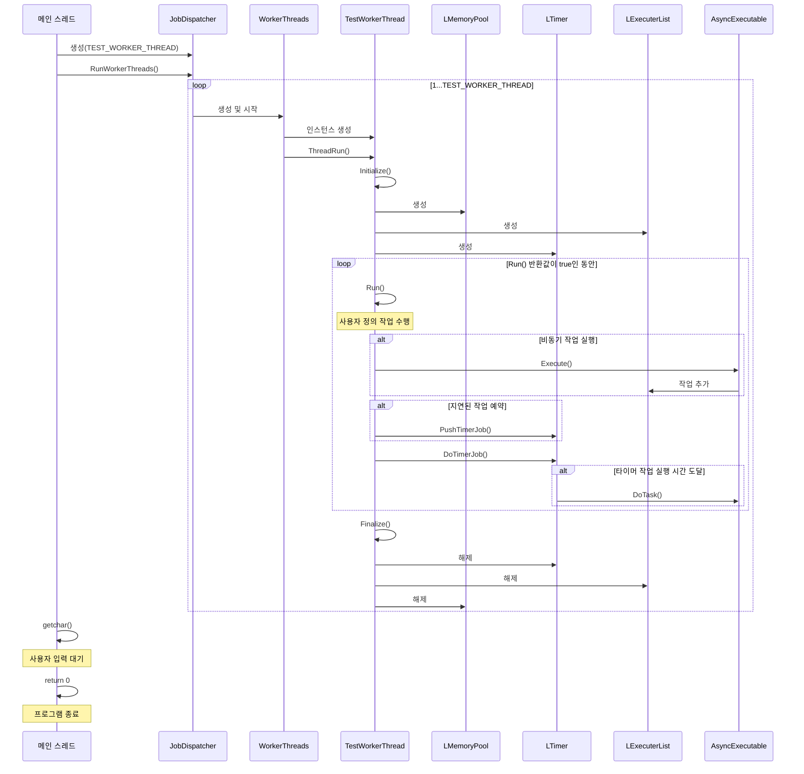
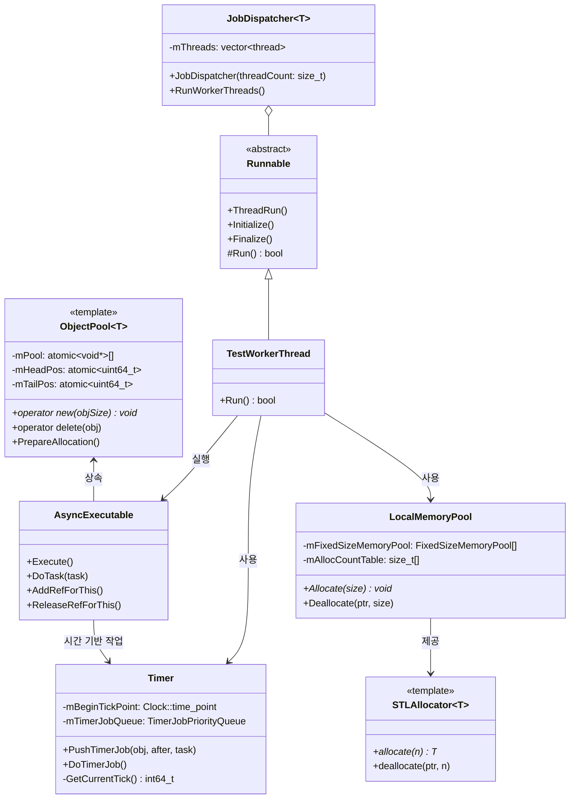
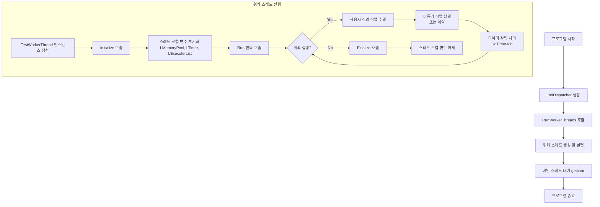
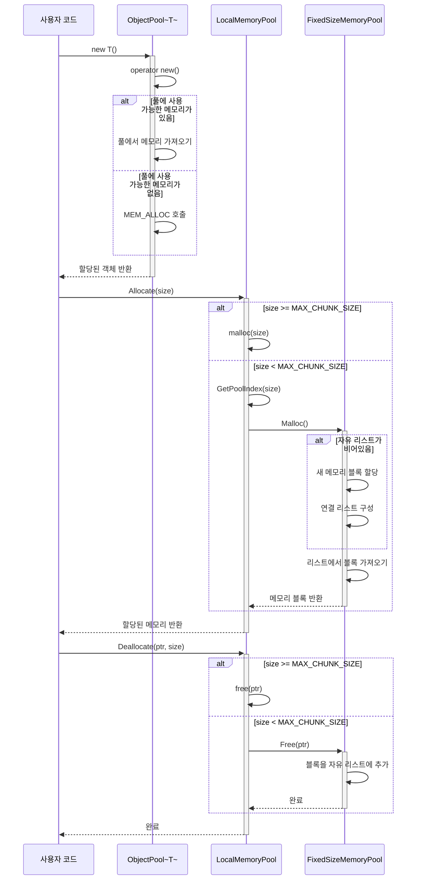

G.O.D: Grand Object-bound Dispatcher
==========

G.O.D is a high performance non-blocking task dispatcher which guarantees class member functions' execution sequence 

## FEATURES
* Designed for multi-platform by using C++11 standard
 * Visual Studio Solutions for now, but you can easily use in *NIX environment (Just #include relevant files)
* Lock-free algorithms (non-blocking)
* Using custom STL allocator
* Deferred task execution using Timer
* Simple code-base for easy to understand (easy to adapt to other projects)

## REAL WORLD EXAMPLES
* [TERA's Lock-Free Executor and Timer](http://download.enmasse.com/documents/201205-gdm-tera.pdf)
  - Conceptually the same, but G.O.D is a improved version of TERA's.
* [Mac OS X Grand Central Dispatch (GCD)](http://en.wikipedia.org/wiki/Grand_Central_Dispatch)
  - G.O.D is a kind of minimal/portable version of GCD
 
## BRANCHES
* base_version: basic version for educational purposes
* bind_version: std::bind is adopted instead of a custom Job class interface
* LB_version: load-balancing among worker-threads (new arrival!)

## HOW TO USE 
```C++
// First, you can attach G.O.D (AsyncExecutable) to an object like this:
class TestObject : public AsyncExecutable
{
public:

	void TestFunc(double a, int b)
	{
	  // do something... 
	  // (e.g.) someobj->DoAsync(...);
	}
	
	// ... ...
};

// somewhere ... 
auto testobj = std::make_shared<TestObject>(); ///< new TestObject;

// And then, make your own worker thread which implements Runnable::Run() like this:
class TestWorkerThread : public Runnable
{
public:
	virtual bool Run()
	{
	   // Now, you can call a member function like this:
	   testobj->DoAsync(&TestObject::TestFunc, 100.123, 456);

	   // or, deferred execution 1000ms later like this:
	   testobj->DoAsyncAfter(1000, &TestObject::TestFunc, 100.123, 456);
	   
	   // ... ...
	}
};

// Lastly, run worker-threads at the main() function
JobDispatcher<TestWorkerThread> workerService(WORKER_COUNT);
workerService.RunWorkerThreads();

```

For more information, just see self-explaning [DispatcherTest.cpp](JobDispatcher/DispatcherTest.cpp)  

## WARNING!
1. You should use x64 mode due to std::atomic variable alignment
2. You should guarantee the lifetime (i.e. AsyncExecutable::mRefCount > 0) of an object inherited from AsyncExecutable
3. Be careful to use DoAsync(...) in a blockable LOCK (critical section). It can cause deadlock... 
  
   
<br>     
  
# 구현 설명 
Claude AI를 사용하여 만들었다.  
  
## main 함수를 시작으로 코드 흐름  
```
#include "DispatcherTest.h"

int _tmain(int argc, _TCHAR* argv[])
{	
	JobDispatcher<TestWorkerThread> workerService(TEST_WORKER_THREAD);

	workerService.RunWorkerThreads();


	//for (auto& t : gTestObjects)
	//	std::cout << "TestCount: " << t->GetTestCount() << std::endl;

	getchar();
	return 0;
}
```   
    
코드의 흐름을 Mermaid 다이어그램으로 설명해드리겠습니다. 먼저 시퀀스 다이어그램으로 메인 함수의 실행 흐름을 보여드리고, 그 다음 전체 시스템 구조를 클래스 다이어그램으로 설명하겠습니다.  

### 1. 메인 함수의 실행 흐름 (시퀀스 다이어그램)    

  
### 2. 전체 시스템 구조 (클래스 다이어그램)  

    
### 3. 흐름 요약 (플로우차트)  

    
### 4. 메모리 관리 흐름 (시퀀스 다이어그램)

   
### 시스템 동작 설명
이 다이어그램들을 통해 코드의 실행 흐름을 명확하게 이해할 수 있습니다:  
  
#### 1. 초기화 단계:
- 메인 함수에서 JobDispatcher 인스턴스를 생성합니다.
- RunWorkerThreads()를 호출하여 워커 스레드 풀을 시작합니다.
- 각 워커 스레드는 자체 TestWorkerThread 인스턴스를 생성합니다.
#### 2. 워커 스레드 실행 단계:
- 각 워커 스레드는 Initialize()를 호출하여 스레드 로컬 변수를 초기화합니다:
    - LMemoryPool: 메모리 할당을 최적화하는 스레드별 메모리 풀
	- LTimer: 시간 기반 작업 관리
	- LExecuterList: 실행할 비동기 작업 목록
- 그 후 Run() 메서드를 반복적으로 호출하며 작업을 수행합니다.
- 각 반복마다 DoTimerJob()을 호출하여 예약된 타이머 작업을 처리합니다.
#### 3. 비동기 작업 처리:
- 워커 스레드는 AsyncExecutable 객체를 통해 비동기 작업을 실행할 수 있습니다.
- 작업은 즉시 실행되거나 LTimer를 통해 나중에 실행되도록 예약될 수 있습니다.
- 비동기 작업은 스레드별 실행자 목록(LExecuterList)에 의해 관리됩니다.
#### 4.메모리 관리:
- 메모리 할당은 다층적 시스템을 통해 최적화됩니다:
    - ObjectPool: 특정 타입 객체의 생성/삭제 오버헤드를 줄입니다.
	- LocalMemoryPool: 다양한 크기의 메모리 할당을 효율적으로 처리합니다.
	- FixedSizeMemoryPool: 고정 크기 메모리 블록을 관리합니다.
- 이 시스템은 락 없이 원자적 연산을 사용하여 스레드 안전성을 보장합니다.
#### 5. 정리 단계:
- Run()이 false를 반환하면 워커 스레드는 Finalize()를 호출합니다.
- 스레드 로컬 리소스가 해제됩니다.
- 메인 함수는 사용자 입력을 기다린 후 종료됩니다.  
    
이 시스템의 핵심 강점은 멀티스레딩과 메모리 관리를 위한 효율적이고 확장 가능한 프레임워크를 제공하는 것입니다. 스레드별 로컬 상태를 활용하여 경합을 최소화하고, 특수화된 메모리 관리 기법을 통해 성능을 최적화합니다.   

이 코드는 앞서 살펴봤던 스레드 관리 및 작업 분배(Job Dispatcher) 시스템을 사용하는 간단한 메인 함수입니다. 이 코드의 흐름과 기능을 앞서 분석한 코드들을 바탕으로 자세히 설명해드리겠습니다.  
  

## main 함수 코드 설명

```cpp
#include "DispatcherTest.h"

int _tmain(int argc, _TCHAR* argv[])
{    
    JobDispatcher<TestWorkerThread> workerService(TEST_WORKER_THREAD);

    workerService.RunWorkerThreads();

    //for (auto& t : gTestObjects)
    //    std::cout << "TestCount: " << t->GetTestCount() << std::endl;

    getchar();
    return 0;
}
```

### 1. 헤더 파일 포함

```cpp
#include "DispatcherTest.h"
```

- `DispatcherTest.h` 파일은 테스트에 필요한 클래스 및 상수 정의를 포함하고 있을 것입니다.
- 이 헤더 파일은 아마도 `TestWorkerThread` 클래스와 `TEST_WORKER_THREAD` 상수를 정의하고 있을 것입니다.

### 2. 메인 함수

```cpp
int _tmain(int argc, _TCHAR* argv[])
```

- `_tmain`은 Windows 환경에서 유니코드/ANSI 호환성을 위한 매크로입니다.
- 유니코드 빌드에서는 `wmain`으로, ANSI 빌드에서는 `main`으로 확장됩니다.
- 이는 프로그램의 진입점 함수입니다.

### 3. JobDispatcher 인스턴스 생성

```cpp
JobDispatcher<TestWorkerThread> workerService(TEST_WORKER_THREAD);
```

- `JobDispatcher` 템플릿 클래스의 인스턴스를 생성합니다.
- 템플릿 파라미터 `TestWorkerThread`는 `Runnable`을 상속받은 사용자 정의 클래스이다.
- 생성자 인자 `TEST_WORKER_THREAD`는 생성할 워커 스레드의 수를 지정합니다.
  
`JobDispatcher` 클래스의 구현을 기반으로:
- 생성자 내부에서 `static_assert`를 통해 `TestWorkerThread`가 `Runnable`로 변환 가능한지 확인합니다.
- 이 인스턴스는 `TEST_WORKER_THREAD` 개수만큼의 워커 스레드를 생성하고 관리할 준비를 합니다.

### 4. 워커 스레드 실행

```cpp
workerService.RunWorkerThreads();
```

이 메서드 호출은 다음과 같이 동작합니다:

1. `TEST_WORKER_THREAD` 개수만큼의 스레드를 생성합니다.
2. 각 스레드는 `TestWorkerThread::ThreadRun` 메서드를 실행합니다.
3. 각 스레드는 `std::make_unique<TestWorkerThread>()`를 통해 자체 `TestWorkerThread` 인스턴스를 가집니다.

`Runnable::ThreadRun()` 메서드의 구현에 따라, 각 스레드는 다음과 같은 흐름으로 실행됩니다:

a. **초기화 단계**:
   - `Initialize()` 호출:
     - `LMemoryPool = new LocalMemoryPool` - 스레드 로컬 메모리 풀 초기화
     - `LExecuterList = new ExecuterListType` - 실행자 목록 초기화
     - `LTimer = new Timer` - 타이머 초기화

b. **작업 처리 루프**:
   - 무한 루프에서 `TestWorkerThread::Run()` 메서드 반복 호출
   - `Run()` 메서드가 `false`를 반환하면 루프 종료
   - 각 반복마다 `LTimer->DoTimerJob()` 호출하여 예약된 타이머 작업 실행

c. **정리 단계**:
   - `Finalize()` 호출:
     - `delete LTimer`
     - `delete LExecuterList`
     - `delete LMemoryPool`

4. 메인 스레드는 `join()`을 통해 모든 워커 스레드가 종료될 때까지 대기합니다.
  
  
### 전체 시스템 흐름
  
1. **프로그램 시작**: 메인 함수 실행

2. **작업 디스패처 초기화**:
   - `JobDispatcher<TestWorkerThread>` 인스턴스 생성
   - `TestWorkerThread`는 `Runnable`을 상속받은 사용자 정의 클래스

3. **워커 스레드 풀 시작**:
   - `RunWorkerThreads()` 호출
   - 지정된 수(`TEST_WORKER_THREAD`)만큼의 스레드 생성
   - 각 스레드는 각자의 `TestWorkerThread` 인스턴스로 `ThreadRun()` 실행

4. **각 워커 스레드 실행**:
   - **초기화**: 
     - 스레드 로컬 변수들 초기화(`LMemoryPool`, `LExecuterList`, `LTimer`)
     - 메모리 풀은 메모리 할당을 최적화
     - 타이머는 시간 기반 작업을 관리

   - **작업 처리 루프**:
     - `TestWorkerThread::Run()` 반복 호출
     - 사용자 정의 작업 처리
     - 타이머 작업 실행

   - **비동기 작업 처리**:
     - `AsyncExecutable` 객체들을 통한 비동기 작업 처리
     - 각 스레드는 자체 `ExecuterListType`을 통해 작업 관리
     - `ObjectPool`을 통한 효율적인 객체 할당/해제

5. **메인 스레드**:
   - 모든 워커 스레드의 완료를 대기
   - 사용자 입력 대기(`getchar()`)
   - 프로그램 종료

## TestWorkerThread 클래스 예상 구현

코드에는 나와있지 않지만, `TestWorkerThread` 클래스는 아마도 다음과 같은 구조를 가질 것입니다:

```cpp
class TestWorkerThread : public Runnable
{
public:
    TestWorkerThread() 
    {
        // 초기화 코드
    }

    virtual bool Run() override
    {
        // 실제 작업을 수행하는 코드
        // ...

        // 예: 비동기 작업 실행
        // AsyncExecutable* task = ...;
        // task->Execute();

        // 예: 타이머 작업 예약
        // LTimer->PushTimerJob(owner, delay, job);

        return true; // 계속 실행
    }

    // 기타 필요한 메서드들
};
```

### 시스템 특징 요약

이 코드가 실행하는 전체 시스템은 다음과 같은 특징을 가집니다:

1. **멀티스레딩**: 여러 워커 스레드를 통한 병렬 처리
2. **비동기 작업 처리**: `AsyncExecutable` 객체를 통한 비동기 작업 실행
3. **메모리 최적화**: 스레드별 메모리 풀과 객체 풀을 통한 메모리 관리
4. **시간 기반 이벤트**: 타이머 시스템을 통한 지연된 작업 실행
5. **무락(Lock-Free) 구현**: 원자적 연산을 통한 효율적인 동시성 제어
6. **스케일러블 아키텍처**: 워커 스레드 수를 조정하여 하드웨어에 맞게 최적화 가능

이러한 특성은 게임 서버, 고성능 네트워킹 시스템, 실시간 애플리케이션 등 고성능이 요구되는 멀티스레드 시스템에서 특히 유용합니다.
    
      
## TupleUnpacker
```
template <int N>
struct TupleUnpacker
{
	template <class ObjType, class... FuncArgs, class... TupleArgs, class... Args>
	static void DoExecute(ObjType* obj, void (ObjType::*memfunc)(FuncArgs...), const std::tuple<TupleArgs...>& targ, Args&&... args)
	{
		TupleUnpacker<N - 1>::DoExecute(obj, memfunc, targ, std::get<N - 1>(targ), std::forward<Args>(args)...);
	}
};

template <>
struct TupleUnpacker<0>
{
	template <class ObjType, class... FuncArgs, class... TupleArgs, class... Args>
	static void DoExecute(ObjType* obj, void (ObjType::*memfunc)(FuncArgs...), const std::tuple<TupleArgs...>& targ, Args&&... args)
	{
		(obj->*memfunc)(std::forward<Args>(args)...);
	}
};


template <class ObjType, class... FuncArgs, class... TupleArgs>
void DoExecuteTuple(ObjType* obj, void (ObjType::*memfunc)(FuncArgs...), std::tuple<TupleArgs...> const& targ)
{
	TupleUnpacker<sizeof...(TupleArgs)>::DoExecute(obj, memfunc, targ);
}
```  
이 C++ 코드는 튜플의 요소들을 클래스 멤버 함수의 인자로 사용하기 위한 튜플 언패킹(tuple unpacking) 메커니즘을 구현한 것입니다.

### `TupleUnpacker` 템플릿 구조체
- 템플릿 파라미터 `N`은 튜플에서 언패킹할 요소의 수를 나타냅니다.
- `DoExecute` 함수는 재귀적으로 튜플의 요소들을 언패킹합니다.
- 매 재귀 호출마다 튜플의 `N-1` 위치에 있는 요소를 추출하여 인자 목록에 추가합니다.

### `TupleUnpacker<0>` 특수화
- 재귀의 기저 조건(base case)입니다.
- 모든 튜플 요소가 언패킹되었을 때, 최종적으로 멤버 함수를 호출합니다.
- `(obj->*memfunc)(std::forward<Args>(args)...)` 구문은 언패킹된 모든 인자와 함께 객체의 멤버 함수를 호출합니다.

### `DoExecuteTuple` 함수
- 사용자 인터페이스 함수로, 템플릿 메타프로그래밍의 복잡성을 숨깁니다.
- `sizeof...(TupleArgs)`를 사용하여 튜플 내 요소의 개수를 구하고, 그에 맞는 `TupleUnpacker`를 호출합니다.

### 작동 방식

예를 들어, 3개의 요소를 가진 튜플 `(a, b, c)`이 있다면:

1. `DoExecuteTuple`은 `TupleUnpacker<3>::DoExecute`를 호출합니다.
2. `TupleUnpacker<3>::DoExecute`는 튜플의 2번째 요소(c)를 추출하고 `TupleUnpacker<2>::DoExecute`를 호출합니다.
3. `TupleUnpacker<2>::DoExecute`는 튜플의 1번째 요소(b)를 추출하고 `TupleUnpacker<1>::DoExecute`를 호출합니다.
4. `TupleUnpacker<1>::DoExecute`는 튜플의 0번째 요소(a)를 추출하고 `TupleUnpacker<0>::DoExecute`를 호출합니다.
5. `TupleUnpacker<0>::DoExecute`는 최종적으로 객체의 멤버 함수를 `(obj->*memfunc)(a, b, c)`와 같이 호출합니다.

이 코드는 C++ 템플릿 메타프로그래밍을 사용하여 컴파일 타임에 튜플의 요소들을 풀어서 함수 인자로 전달하는 기능을 구현합니다. 주로 함수형 프로그래밍 패턴이나 콜백 메커니즘 구현에 유용합니다.

    
    
## Job 
이 코드는 비동기 작업 처리를 위한 작업 큐(Job Queue) 시스템의 일부로, C++ 템플릿을 사용한 일반화된 작업(Job) 시스템을 구현하고 있습니다.
  

### `NodeEntry` 구조체
- 연결 리스트를 구현하기 위한 기본 노드 구조체입니다.
- `mNext` 포인터가 `volatile`로 선언되어 있어 멀티스레딩 환경에서 최적화로 인한 문제를 방지합니다.
- 기본 생성자에서 `mNext`를 `nullptr`로 초기화합니다.

### `JobEntry` 구조체
- 작업(Job)의 기본 인터페이스를 정의하는 추상 클래스입니다.
- 가상 소멸자(`virtual ~JobEntry()`)를 갖고 있어 상속 관계에서 안전한 소멸을 보장합니다.
- `OnExecute()` 가상 함수는 작업을 실행하는 인터페이스이며, 파생 클래스에서 재정의됩니다.
- `mNodeEntry`를 멤버로 포함하여 JobEntry 객체가 연결 리스트의 요소로 사용될 수 있게 합니다.

### `Job` 템플릿 클래스
- `JobEntry`를 상속받아 구체적인 작업을 구현합니다.
- `ObjectPool<Job<ObjType, ArgTypes...>>`도 상속받아 메모리 풀링 기능을 사용합니다(객체 재사용을 통한 성능 최적화).
- 템플릿 파라미터:
  - `ObjType`: 메서드를 호출할 객체의 타입
  - `ArgTypes...`: 메서드 인자들의 타입 목록

- 내부 타입 정의:
  - `MemFunc_`: 멤버 함수 포인터 타입 (ObjType의 메서드)
  - `Args_`: 메서드 인자들을 저장할 튜플 타입

- 생성자: 객체 포인터, 멤버 함수 포인터, 함수 인자들을 받아 저장합니다.
- `OnExecute()` 오버라이드: 저장된 객체의 멤버 함수를 저장된 인자들로 호출합니다.
  - 이전 코드에서 설명한 `DoExecuteTuple` 함수를 사용하여 튜플에 저장된 인자들을 언패킹합니다.

### 전체적인 동작 방식

이 코드는 멤버 함수 호출을 지연시키고 비동기적으로 실행할 수 있는 작업 큐 시스템의 일부입니다:

1. 사용자는 `Job` 객체를 생성하여 나중에 실행할 객체, 멤버 함수, 인자들을 저장합니다.
2. 이 `Job` 객체는 작업 큐에 추가됩니다(코드에는 나와있지 않지만, `NodeEntry`를 통해 연결 리스트 형태로 관리될 것으로 추정).
3. 워커 스레드나 처리 로직이 큐에서 작업을 꺼내어 `OnExecute()`를 호출합니다.
4. `OnExecute()`가 호출되면 이전에 저장된 객체의 멤버 함수가 저장된 인자들과 함께 실행됩니다.

이 패턴은 다음과 같은 상황에서 유용합니다:
- 스레드 풀 구현
- 이벤트 처리 시스템
- 콜백 메커니즘
- 작업 스케줄링

`ObjectPool`을 상속받는 것으로 보아 메모리 할당/해제 비용을 최소화하기 위한 최적화도 포함되어 있습니다.
  	
	
## TestWorkerThread  
이 코드는 비동기 작업 처리 시스템을 테스트하는 예제로, `JobDispatcher` 기반의 비동기 실행 메커니즘을 보여줍니다. 각 구성 요소를 자세히 설명해드리겠습니다.

  
### TestEnvironment 열거형
```cpp
enum TestEnvironment
{
    TEST_OBJECT_COUNT = 10,
    TEST_WORKER_THREAD = 4,
};
```
- 테스트 환경 설정을 위한 상수들을 정의합니다.
- `TEST_OBJECT_COUNT`: 테스트에 사용할 객체의 수 (10개)
- `TEST_WORKER_THREAD`: 사용할 워커 스레드의 수 (4개)

### TestObject 클래스
```cpp
class TestObject : public AsyncExecutable
```
- `AsyncExecutable`을 상속받아 비동기 실행 기능을 사용할 수 있는 테스트 객체입니다.
- 멤버 변수 `mTestCount`를 통해 함수 호출 횟수를 추적합니다.

#### 주요 메서드들
1. **TestFunc0()**: 매개변수 없이 `mTestCount`를 1 증가시킵니다.

2. **TestFunc1(int b)**: 매개변수 `b`의 값만큼 `mTestCount`를 증가시킵니다.

3. **TestFunc2(double a, int b)**: 
   - `mTestCount`를 `b`만큼 증가시킵니다.
   - `a`가 50.0 미만이면 **비동기적으로** `TestFunc1`을 호출합니다.
   - `DoAsync` 메서드는 `AsyncExecutable` 클래스에서 상속받은 것으로, 멤버 함수를 비동기적으로 실행할 수 있게 합니다.

4. **TestFuncForTimer(int b)**:
   - 랜덤하게 50% 확률로 1초(1000ms) 후에 다시 자기 자신을 호출하는 타이머 기능을 테스트합니다.
   - 재귀적으로 자신을 호출할 때는 `b`의 부호를 바꿔서 호출합니다.
   - `DoAsyncAfter` 메서드는 지정된 시간(밀리초) 이후에 비동기적으로 함수를 실행합니다.

5. **GetTestCount()**: 현재 `mTestCount` 값을 반환합니다.

### TestWorkerThread 클래스
```cpp
class TestWorkerThread : public Runnable
```
- `Runnable` 인터페이스를 구현하여 스레드로 실행할 수 있는 작업을 정의합니다.
- `gTestObjects` 벡터에 `TestObject` 인스턴스들을 저장합니다.

#### 주요 메서드들
1. **생성자**:
   - `TEST_OBJECT_COUNT`(10개)만큼의 `TestObject` 인스턴스를 생성하여 `gTestObjects` 벡터에 저장합니다.
   - `std::make_shared`를 사용하여 스마트 포인터로 관리합니다.

2. **소멸자**:
   - "tt dtor" 메시지를 출력합니다.

3. **Run()**:
   - 스레드의 주요 실행 로직입니다. `Runnable` 인터페이스에서 오버라이드된 메서드입니다.
   - 0~1999 사이의 랜덤 시간(`after`)을 생성합니다.
   - `after`가 1000보다 크면:
     - 랜덤하게 선택된 `TestObject`에서 `TestFunc0`을 비동기적으로 호출합니다.
     - 랜덤하게 선택된 `TestObject`에서 `TestFunc2`를 비동기적으로 호출합니다(랜덤 `double` 값과 2를 인자로).
     - 랜덤하게 선택된 `TestObject`에서 `TestFunc1`을 비동기적으로 호출합니다(1을 인자로).
     - 랜덤하게 선택된 `TestObject`에서 `after` 밀리초 후에 `TestFuncForTimer`를 비동기적으로 호출합니다.
   
   - **종료 조건**: 
     - 랜덤하게 선택된 `TestObject`의 `mTestCount`가 5000을 초과하면 스레드를 종료합니다(`false` 반환).
     - 그렇지 않으면 계속 실행합니다(`true` 반환).

4. **PrintTestCount()**:
   - 모든 `TestObject` 인스턴스의 `mTestCount` 값을 출력합니다.

### 코드의 동작 흐름

1. `TestWorkerThread` 인스턴스가 생성되면 10개의 `TestObject` 인스턴스를 생성하고 벡터에 저장합니다.

2. `Run()` 메서드가 스레드에서 반복적으로 호출됩니다:
   - 랜덤한 지연시간을 생성합니다.
   - 랜덤하게 선택된 객체들에 대해 다양한 비동기 함수 호출을 수행합니다.
   - 일부 호출은 즉시 실행되고(`DoAsync`), 일부는 지연 후 실행됩니다(`DoAsyncAfter`).
   - `TestFunc2`는 조건에 따라 내부에서 다시 `TestFunc1`을 비동기적으로 호출할 수 있습니다.
   - `TestFuncForTimer`는 자기 자신을 재귀적으로 호출하여 타이머 기능을 테스트합니다.

3. 어떤 객체의 `mTestCount`가 5000을 초과하면 스레드가 종료됩니다.

  
이 코드는 다음과 같은 기능과 패턴을 테스트하고 있습니다:

1. **비동기 작업 실행**: `DoAsync`를 통한 함수 호출의 비동기적 실행
2. **지연 실행**: `DoAsyncAfter`를 통한 지연된 함수 호출
3. **재귀적 비동기 호출**: 함수 내에서 다른 함수를 비동기적으로 호출
4. **타이머 기능**: 주기적인 작업 실행
5. **스레드 풀 활용**: 여러 작업을 병렬로 처리하는 능력

이 테스트는 이전에 설명드린 `JobDispatcher`, `Job`, `TupleUnpacker` 등의 코드가 실제로 어떻게 활용되는지 보여주는 사례입니다. 비동기 프로그래밍 패턴을 통해 효율적인 멀티스레딩 애플리케이션을 구현하는 방법을 보여줍니다.  
  
## Runnable 
이 코드는 작업 분배기(Job Dispatcher)와 실행 가능한(Runnable) 작업을 관리하는 프레임워크를 구현하고 있습니다. 멀티스레딩 환경에서 작업을 효율적으로 처리하기 위한 기반 구조를 제공합니다. 각 부분에 대해 자세히 설명해드리겠습니다.
  
```cpp
class Runnable
{
public:
    Runnable() = default;
    virtual ~Runnable() = default;

    void ThreadRun();

    virtual bool Run() = 0;

private:
    void Initialize();
    void Finalize();
};
```
  
### 목적 및 설계
- `Runnable`은 스레드에서 실행될 수 있는 작업의 기본 인터페이스를 정의합니다.
- 추상 클래스로, 파생 클래스에서 구체적인 작업 내용을 정의해야 합니다.

### 주요 메서드
1. **생성자/소멸자**: 
   - 기본 생성자와 가상 소멸자를 제공합니다.
   - `virtual ~Runnable() = default`는 파생 클래스의 올바른 소멸을 보장합니다.

2. **ThreadRun()**:
   - 스레드의 메인 실행 함수입니다.
   - 초기화(`Initialize()`)를 수행합니다.
   - 무한 루프에서 `Run()` 메서드를 반복적으로 호출합니다.
   - `Run()`이 `false`를 반환하면 루프를 종료합니다.
   - 각 반복마다 타이머 작업(`LTimer->DoTimerJob()`)을 실행합니다.
   - 종료 시 `Finalize()`를 호출합니다.

3. **Run()**: 
   - 순수 가상 함수로, 파생 클래스에서 반드시 구현해야 합니다.
   - 작업의 구체적인 내용을 정의합니다.
   - 반환값 `bool`은 작업 계속 여부를 나타냅니다(`true`: 계속, `false`: 종료).

4. **Initialize()**:
   - 스레드별 리소스를 초기화합니다.
   - `LocalMemoryPool`, `ExecuterListType`, `Timer` 인스턴스를 생성합니다.
   - 이 리소스들은 스레드 로컬(thread-local) 리소스로 추정됩니다.

5. **Finalize()**:
   - `Initialize()`에서 생성한 리소스를 정리합니다.
   - 메모리 누수를 방지하기 위해 할당된 객체들을 삭제합니다.

### 전역 변수 (스레드 로컬)
`LMemoryPool`, `LExecuterList`, `LTimer`는 코드에는 명시적으로 선언되어 있지 않지만, 스레드 로컬 변수로 사용되는 것으로 보입니다. 이들은:

- **LMemoryPool**: 스레드별 메모리 풀로, 메모리 할당/해제 최적화에 사용됩니다.
- **LExecuterList**: 실행할 작업 목록을 관리하는 컨테이너입니다.
- **LTimer**: 타이머 이벤트를 관리하고 실행합니다.
  

## JobDispatcher 클래스

```cpp
template <class T>
class JobDispatcher
{
public:
    JobDispatcher(int workerCount) : mWorkerThreadCount(workerCount)
    {
        static_assert(true == std::is_convertible<T*, Runnable*>::value, "only allowed when Runnable");
    }

    void RunWorkerThreads()
    {
        for (int i = 0; i < mWorkerThreadCount; ++i)
        {
            mWorkerThreadList.emplace_back(std::thread(&T::ThreadRun, std::make_unique<T>()));
        }

        for (auto& thread : mWorkerThreadList)
        {
            if (thread.joinable())
                thread.join();
        }
    }

private:
    int mWorkerThreadCount;
    std::vector<std::thread> mWorkerThreadList;
};
```

### 목적 및 설계
- `JobDispatcher`는 여러 워커 스레드를 생성하고 관리하는 템플릿 클래스입니다.
- 템플릿 파라미터 `T`는 `Runnable`을 상속받은 구체적인 작업 클래스입니다.

### 주요 메서드 및 특징
1. **생성자**:
   - 워커 스레드 수(`workerCount`)를 인자로 받습니다.
   - `static_assert`를 사용하여 템플릿 파라미터 `T`가 `Runnable`로 변환 가능한지 컴파일 타임에 확인합니다.
   - 이는 `T`가 `Runnable`을 상속받아야 함을 강제합니다.

2. **RunWorkerThreads()**:
   - 스레드 풀을 생성하고 실행하는 메서드입니다.
   - `mWorkerThreadCount` 만큼의 스레드를 생성합니다.
   - 각 스레드는 `T::ThreadRun` 메서드를 실행하며, 이는 `Runnable::ThreadRun`을 호출합니다.
   - `std::make_unique<T>()`를 사용해 각 스레드마다 독립적인 `T` 인스턴스를 생성합니다.
   - 모든 스레드를 생성한 후, `join()`을 호출하여 모든 스레드가 완료될 때까지 대기합니다.
   - 이는 `JobDispatcher::RunWorkerThreads()`를 호출한 스레드(일반적으로 메인 스레드)가 차단(block)됨을 의미합니다.

### 멤버 변수
- **mWorkerThreadCount**: 생성할 워커 스레드의 수입니다.
- **mWorkerThreadList**: 생성된 스레드 객체들을 저장하는 벡터입니다.

### 전체 아키텍처의 동작

1. 사용자는 `Runnable`을 상속받는 클래스(`T`)를 정의하고, `Run()` 메서드에서 수행할 작업을 구현합니다.

2. `JobDispatcher<T>` 인스턴스를 생성하고, 원하는 워커 스레드 수를 지정합니다.

3. `RunWorkerThreads()`를 호출하면:
   - 지정된 수의 워커 스레드가 생성됩니다.
   - 각 스레드는 자체 `T` 인스턴스에서 `ThreadRun()`을 실행합니다.
   - `ThreadRun()`은 `Initialize()`, 반복적인 `Run()` 호출, `Finalize()`의 흐름으로 실행됩니다.

4. 각 스레드는 독립적으로 작업을 수행하며, `Run()`이 `false`를 반환할 때까지 계속됩니다.

5. 모든 스레드가 종료되면 `RunWorkerThreads()`가 반환되어 프로그램이 계속 진행될 수 있습니다.

## 코드의 특징 및 패턴

1. **템플릿 메타프로그래밍**: 컴파일 타임에 타입 검사를 수행합니다.
2. **인터페이스 기반 설계**: `Runnable`을 통한 공통 인터페이스 정의
3. **스레드 풀 패턴**: 여러 작업을 병렬로 처리하기 위한 워커 스레드 사용
4. **자원 관리**: `Initialize()`와 `Finalize()`를 통한 리소스 생명 주기 관리
5. **스레드 로컬 스토리지**: 각 스레드가 독립적인 리소스를 가짐
6. **이벤트 중심 프로그래밍**: 타이머 이벤트 처리 구조

이 코드는 게임 서버와 같은 고성능 멀티스레드 애플리케이션에서 자주 사용되는 패턴을 구현하고 있습니다.  
    
  
## STLAllocator
 이 코드는 커스텀 메모리 관리 시스템을 구현한 것으로, 메모리 풀링 기법을 사용하여 동적 메모리 할당/해제의 효율성을 높이는 것이 목적입니다. 특히 멀티스레드 환경에서 사용하기 위한 스레드 로컬 메모리 풀을 구현하고 있습니다. 각 부분에 대해 자세히 설명하겠습니다.

### 1. 디버깅 도구: `_ASSERT_CRASH` 매크로

```cpp
#define _ASSERT_CRASH(expr) \
    { \
        if (!(expr)) \
        { \
            int* dummy = 0; \
            *dummy = 0xDEADBEEF; \
        } \
    }
```

- 개발 중 심각한 오류를 즉시 발견하기 위한 크래시 매크로입니다.
- 표현식 `expr`이 거짓(false)이면 널 포인터에 값을 할당하여 의도적으로 프로그램을 크래시시킵니다.
- `0xDEADBEEF`는 디버깅 시 메모리 손상을 표시하는 데 자주 사용되는 16진수 값입니다.
- 일반적인 assert와 달리, 릴리스 빌드에서도 동작합니다.

### 2. `FixedSizeMemoryPool` 클래스

고정 크기의 메모리 블록을 관리하는 메모리 풀 클래스입니다.

#### 주요 속성
- `mAllocSize`: 각 메모리 블록의 크기
- `mFreeList`: 사용 가능한 메모리 블록의 연결 리스트의 헤드 포인터

#### 주요 메서드

##### `Malloc()`: 메모리 블록을 할당합니다.
```cpp
void* Malloc()
{
    if (!mFreeList)
    {
        mFreeList = static_cast<uint8_t*>(malloc(mAllocSize*ALLOC_COUNT));

        uint8_t* pNext = mFreeList;
        uint8_t** ppCurr = reinterpret_cast<uint8_t**>(mFreeList);

        for (int i = 0; i < ALLOC_COUNT - 1; ++i)
        {
            pNext += mAllocSize;
            *ppCurr = pNext;
            ppCurr = reinterpret_cast<uint8_t**>(pNext);
        }

        *ppCurr = 0;
    }

    uint8_t* pAvailable = mFreeList;
    mFreeList = *reinterpret_cast<uint8_t**>(pAvailable);

    return pAvailable;
}
```
- 사용 가능한 블록이 없으면 (`mFreeList`가 `nullptr`):
  1. `mAllocSize * ALLOC_COUNT` 크기의 메모리 청크를 할당합니다.
  2. 이 메모리를 `mAllocSize` 크기의 블록들로 나누고, 각 블록의 첫 부분에 다음 블록의 포인터를 저장하여 연결 리스트를 형성합니다.
  3. 마지막 블록의 다음 포인터는 `nullptr`로 설정합니다.
- 사용 가능한 블록이 있으면:
  1. 리스트의 첫 번째 블록을 가져옵니다.
  2. `mFreeList`를 다음 블록으로 업데이트합니다.
  3. 할당된 블록의 포인터를 반환합니다.

##### `Free(void* ptr)`: 메모리 블록을 반환합니다.
```cpp
void Free(void* ptr)
{
    *reinterpret_cast<uint8_t**>(ptr) = mFreeList;
    mFreeList = static_cast<uint8_t*>(ptr);
}
```
- 반환된 메모리 블록을 자유 리스트(free list)의 앞에 추가합니다:
  1. 반환된 블록의 첫 부분에 현재 `mFreeList` 값을 저장합니다.
  2. `mFreeList`를 반환된 블록으로 업데이트합니다.

##### `SetFixedAllocSize(size_t size)`: 메모리 블록 크기를 설정합니다.
```cpp
void SetFixedAllocSize(size_t size)
{
    _ASSERT_CRASH(size >= sizeof(size_t));
    mAllocSize = size;
}
```
- 메모리 블록의 크기를 설정합니다.
- 블록 크기는 최소한 포인터 크기(`sizeof(size_t)`) 이상이어야 합니다.

### 3. `LocalMemoryPool` 클래스

다양한 크기의 메모리 요청을 효율적으로 처리하기 위한 계층적 메모리 풀 시스템입니다.

#### 주요 상수
```cpp
enum Config
{
    ALLOC_GRANULARITY = 8,
    MAX_CHUNK_SIZE = 16384, ///< goes FixedSizeMemoryPool only when required mem-size is less than MAX_CHUNK_SIZE 
    MAX_POOL_SIZE = MAX_CHUNK_SIZE / ALLOC_GRANULARITY
};
```
- `ALLOC_GRANULARITY`: 메모리 할당 단위(8바이트)
- `MAX_CHUNK_SIZE`: 풀을 사용할 최대 메모리 크기(16KB)
- `MAX_POOL_SIZE`: 유지할 메모리 풀의 수(2048)

#### 주요 속성
- `mFixedSizeMemoryPool`: 다양한 크기의 메모리 블록을 관리하는 `FixedSizeMemoryPool` 배열
- `mAllocCountTable`: 각 풀에서 할당된 블록 수를 추적하는 배열

#### 주요 메서드

##### 생성자
```cpp
LocalMemoryPool()
{
    for (int i = 0; i < MAX_POOL_SIZE; ++i)
    {
        mAllocCountTable[i] = 0;
        mFixedSizeMemoryPool[i].SetFixedAllocSize((i + 1) * ALLOC_GRANULARITY);
    }
}
```
- 각 메모리 풀을 초기화하고, 할당 카운터를 0으로 설정합니다.
- 각 풀은 8바이트씩 증가하는 크기의 블록을 관리합니다(8, 16, 24, ..., 16384바이트).

##### `Allocate(size_t size)`: 메모리를 할당합니다.
```cpp
void* Allocate(size_t size)
{
    if (size >= MAX_CHUNK_SIZE)
    {
        return malloc(size);
    }
    else
    {
        size_t idx = GetPoolIndex(size);
        ++mAllocCountTable[idx];
        return mFixedSizeMemoryPool[idx].Malloc();
    }
}
```
- 요청된 크기가 `MAX_CHUNK_SIZE`(16KB) 이상이면 표준 `malloc`을 사용합니다.
- 그렇지 않으면:
  1. 적절한 풀의 인덱스를 계산합니다.
  2. 해당 풀의 할당 카운터를 증가시킵니다.
  3. 해당 풀에서 메모리 블록을 할당받아 반환합니다.

##### `Deallocate(void* ptr, size_t size)`: 메모리를 해제합니다.
```cpp
void Deallocate(void* ptr, size_t size)
{
    if (size >= MAX_CHUNK_SIZE)
    {
        return free(ptr);
    }
    else
    {
        size_t idx = GetPoolIndex(size);
        --mAllocCountTable[idx];
        mFixedSizeMemoryPool[idx].Free(ptr);
    }
}
```
- 요청된 크기가 `MAX_CHUNK_SIZE`(16KB) 이상이면 표준 `free`를 사용합니다.
- 그렇지 않으면:
  1. 적절한 풀의 인덱스를 계산합니다.
  2. 해당 풀의 할당 카운터를 감소시킵니다.
  3. 메모리 블록을 해당 풀로 반환합니다.

##### `PrintAllocationStatus()`: 메모리 할당 상태를 출력합니다.
```cpp
void PrintAllocationStatus()
{
    for (int i = 0; i < MAX_POOL_SIZE; ++i)
    {
        if (mAllocCountTable[i] > 0)
            printf("SIZE: %d, Allocation Count: %d\n", (i + 1) * ALLOC_GRANULARITY, (int)mAllocCountTable[i]);
    }
}
```
- 현재 할당된 블록이 있는 각 풀에 대해 블록 크기와 할당 수를 출력합니다.

##### `GetPoolIndex(size_t size)`: 적절한 풀 인덱스를 계산합니다.
```cpp
size_t GetPoolIndex(size_t size) const 
{ 
    return size / ALLOC_GRANULARITY; 
}
```
- 요청된 크기에 맞는 가장 작은 풀의 인덱스를 계산합니다.

#### 컴파일 시간 검사
```cpp
void* __powerof2check1__[((MAX_CHUNK_SIZE & (MAX_CHUNK_SIZE - 1)) == 0x0) & 0x1];
void* __powerof2check2__[((ALLOC_GRANULARITY & (ALLOC_GRANULARITY - 1)) == 0x0) & 0x1];
```
- 이 코드는 `MAX_CHUNK_SIZE`와 `ALLOC_GRANULARITY`가 2의 거듭제곱인지 컴파일 시간에 검사합니다.
- 조건이 거짓이면 크기가 0인 배열 선언이 되어 컴파일 오류가 발생합니다.
  


## 4. `STLAllocator` 템플릿 클래스
  
STL 컨테이너와 함께 사용할 수 있는 커스텀 할당자(allocator)입니다.  

```cpp
template <class T>
class STLAllocator
{
public:
    // ... 표준 allocator 인터페이스 정의 ...

    T* allocate(size_t n)
    {
        return static_cast<T*>(LMemoryPool->Allocate(n*sizeof(T)));
    }

    void deallocate(T* ptr, size_t n)
    {
        LMemoryPool->Deallocate(ptr, n*sizeof(T));
    }
};
```

- 이 클래스는 C++ 표준 라이브러리의 할당자 요구 사항을 충족합니다.
- STL 컨테이너의 메모리 할당/해제를 `LocalMemoryPool`을 통해 수행하도록 합니다.
- `LMemoryPool`은 스레드 로컬 변수로, 각 스레드가 자체 메모리 풀을 가지도록 합니다.
  
#### 주요 특징
1. `allocate(size_t n)`: `n`개의 `T` 타입 객체를 위한 메모리를 할당합니다.
2. `deallocate(T* ptr, size_t n)`: 할당된 메모리를 해제합니다.
3. 나머지 메서드들은 STL 할당자 인터페이스를 충족하기 위한 것입니다.

### 전체 시스템의 주요 특징

1. **메모리 풀링**: 동적 메모리 할당/해제의 오버헤드를 줄입니다.
2. **스레드 로컬 스토리지**: 각 스레드가 자체 메모리 풀을 가져 스레드 간 경합을 방지합니다.
3. **크기별 최적화**: 다양한 크기의 메모리 요청을 효율적으로 처리합니다.
4. **STL 통합**: STL 컨테이너와 함께 사용할 수 있는 사용자 정의 할당자를 제공합니다.
5. **디버깅 지원**: 할당 추적 및 크래시 매크로를 통한 디버깅을 지원합니다.
6. **2의 거듭제곱 최적화**: 메모리 정렬과 인덱싱의 효율성을 위해 2의 거듭제곱 상수를 사용합니다.

이 코드는 게임 엔진이나 고성능 서버와 같은 성능에 민감한 애플리케이션에서 메모리 관리를 최적화하기 위한 전형적인 접근 방식을 보여줍니다. 메모리 단편화를 줄이고, 할당/해제 속도를 높이며, 스레드 간 경합을 최소화하는 것이 주요 목표입니다. 
    
   
  
  
  
## Object Pool 
이 코드는 멀티스레드 환경에서 사용할 수 있는 고성능 객체 풀(Object Pool) 구현을 담고 있습니다. 객체의 생성과 파괴에 따른 메모리 할당/해제 오버헤드를 줄이는 동시에, 멀티스레드 환경에서도 락(lock)을 사용하지 않고 안전하게 동작하도록 설계되었습니다. 코드를 자세히 분석해보겠습니다.

### 1. 플랫폼별 메모리 할당 매크로

```cpp
#define ALIGNMENT 8

#ifdef WIN32
#define EXPLICIT_MEMORY_ALIGNMENT __declspec(align(ALIGNMENT))
#define MEM_ALLOC(x)    _aligned_malloc(x, ALIGNMENT)
#define MEM_FREE(x)     _aligned_free(x)
#elif defined __APPLE__
#include <stdlib.h>
#define EXPLICIT_MEMORY_ALIGNMENT __attribute__((aligned(ALIGNMENT)))
#define MEM_ALLOC(x)    malloc(x)
#define MEM_FREE(x)     free(x)
#else
#include <malloc.h>
#define EXPLICIT_MEMORY_ALIGNMENT __attribute__((aligned(ALIGNMENT)))
#define MEM_ALLOC(x)    memalign(ALIGNMENT, x)
#define MEM_FREE(x)     free(x)
#endif 
```

이 부분은 플랫폼별 메모리 정렬과 할당/해제 함수를 정의합니다:

- `ALIGNMENT`: 메모리 정렬 값으로 8바이트로 설정되어 있습니다.
- `EXPLICIT_MEMORY_ALIGNMENT`: 변수나 객체를 특정 바이트 경계에 정렬하도록 지시하는 컴파일러 지시어입니다.
  - Windows에서는 `__declspec(align(ALIGNMENT))`
  - 다른 플랫폼(Linux, macOS 등)에서는 `__attribute__((aligned(ALIGNMENT)))`

- 메모리 할당/해제 함수:
  - Windows: `_aligned_malloc`/`_aligned_free` - 정렬된 메모리 할당/해제
  - macOS: 표준 `malloc`/`free`
  - 다른 Unix/Linux: `memalign`/`free` - 정렬된 메모리 할당 후 표준 해제

정렬된 메모리 할당은 캐시 성능과 SIMD 연산 같은 하드웨어 최적화를 위해 중요합니다.

### 2. `ObjectPool` 템플릿 클래스

```cpp
template <class T>
class ObjectPool
{
    // 구현 내용
};
```

이 클래스는 타입 `T` 객체들을 위한 풀을 제공합니다. 사용자가 `T` 클래스를 상속받아 사용할 수 있도록 템플릿으로 구현되었습니다.

#### 2.1 상수 및 검증

```cpp
enum
{
    POOL_MAX_SIZE = 4096, ///< must be power of 2
    POOL_SIZE_MASK = POOL_MAX_SIZE - 1
};

// ...

static_assert((POOL_MAX_SIZE & POOL_SIZE_MASK) == 0x0, "pool's size must be power of 2");
```

- `POOL_MAX_SIZE`: 풀의 최대 크기로 4096(2^12)으로 설정
- `POOL_SIZE_MASK`: 풀의 인덱스 계산을 위한 비트 마스크(4095 = 0xFFF)
- `static_assert`를 사용하여 컴파일 시간에 `POOL_MAX_SIZE`가 2의 거듭제곱임을 확인

`POOL_MAX_SIZE`가 2의 거듭제곱이어야 하는 이유는 모듈로 연산(`&` 연산자로 최적화됨)을 통해 배열 인덱스를 효율적으로 계산하기 위함입니다.

#### 2.2 정적 멤버 변수

```cpp
static std::atomic<void*>      EXPLICIT_MEMORY_ALIGNMENT    mPool[POOL_MAX_SIZE];
static std::atomic<uint64_t>   EXPLICIT_MEMORY_ALIGNMENT    mHeadPos;
static std::atomic<uint64_t>   EXPLICIT_MEMORY_ALIGNMENT    mTailPos;
```

- `mPool`: 재사용 가능한 객체 포인터를 저장하는 원형 버퍼(circular buffer)입니다.
  - `std::atomic<void*>` 타입을 사용하여 스레드 안전성을 보장합니다.
  - 메모리 정렬 지시어를 통해 메모리 경계에 정렬됩니다.

- `mHeadPos`: 풀에서 객체를 가져올 위치를 나타내는 카운터입니다.
  - 새 객체가 필요할 때마다 증가합니다.

- `mTailPos`: 해제된 객체를 풀에 반환할 위치를 나타내는 카운터입니다.
  - 객체가 삭제될 때마다 증가합니다.

이 변수들은 클래스 외부에서 다음과 같이 초기화됩니다:

```cpp
template <class T>
std::atomic<void*> ObjectPool<T>::mPool[POOL_MAX_SIZE] = {};

template <class T>
std::atomic<uint64_t> ObjectPool<T>::mHeadPos(0);

template <class T>
std::atomic<uint64_t> ObjectPool<T>::mTailPos(0);
```

#### 2.3 `PrepareAllocation` 메서드

```cpp
static void PrepareAllocation()
{
    for (int i = 0; i < POOL_MAX_SIZE; ++i)
        mPool[i] = MEM_ALLOC(sizeof(T));

    mTailPos.fetch_add(POOL_MAX_SIZE);
}
```

- 이 메서드는 사전에 풀에 메모리를 할당하여 준비합니다(선택 사항).
- 풀의 모든 슬롯에 타입 `T` 크기만큼의 메모리를 할당합니다.
- `mTailPos`를 `POOL_MAX_SIZE`만큼 증가시켜 풀이 가득 찼음을 표시합니다.
- 이를 통해 초기 메모리 할당 오버헤드를 프로그램 시작 시점으로 이동시킵니다.

### 2.#4 `operator new` 오버로딩

```cpp
static void* operator new(size_t objSize)
{
    uint64_t popPos = mHeadPos.fetch_add(1);

    void* popVal = std::atomic_exchange(&mPool[popPos & POOL_SIZE_MASK], (void*)nullptr);
    if (popVal != nullptr)
        return popVal;

    return MEM_ALLOC(objSize);
}
```

이 메서드는 `T` 타입의 객체가 생성될 때 호출됩니다:

1. `mHeadPos`를 원자적으로 1 증가시키고 이전 값(`popPos`)을 가져옵니다.
2. `popPos & POOL_SIZE_MASK`로 원형 버퍼의 인덱스를 계산합니다.
3. `std::atomic_exchange`를 사용하여 해당 위치의 값을 `nullptr`로 설정하고 이전 값(`popVal`)을 가져옵니다.
   - 이는 원자적 연산으로, 다른 스레드와의 경합 없이 안전하게 값을 교환합니다.
4. 가져온 값(`popVal`)이 `nullptr`가 아니면 이미 할당된 메모리가 있으므로 그것을 반환합니다.
5. 값이 `nullptr`이면 풀에 사용 가능한 메모리가 없으므로 `MEM_ALLOC`으로 새로 할당합니다.

#### 2.5 `operator delete` 오버로딩

```cpp
static void operator delete(void* obj)
{
    uint64_t insPos = mTailPos.fetch_add(1);

    void* prevVal = std::atomic_exchange(&mPool[insPos & POOL_SIZE_MASK], obj);

    if (prevVal != nullptr)
        MEM_FREE(prevVal);
}
```

이 메서드는 `T` 타입의 객체가 삭제될 때 호출됩니다:

1. `mTailPos`를 원자적으로 1 증가시키고 이전 값(`insPos`)을 가져옵니다.
2. `insPos & POOL_SIZE_MASK`로 원형 버퍼의 인덱스를 계산합니다.
3. `std::atomic_exchange`를 사용하여 해당 위치에 삭제된 객체의 메모리(`obj`)를 저장하고 이전 값(`prevVal`)을 가져옵니다.
4. 이전 값(`prevVal`)이 `nullptr`가 아니면, 해당 슬롯에 이미 다른 메모리가 있었다는 뜻이므로 그것을 `MEM_FREE`로 해제합니다.
   - 이는 풀이 가득 찼을 때 가장 오래된 메모리를 해제하는 방식으로 동작합니다.

### 3. 설계 원리 및 특징

#### 3.1 무락(Lock-Free) 구현

이 객체 풀은 락을 사용하지 않고 `std::atomic` 타입과 원자적 연산을 활용하여 스레드 안전성을 보장합니다:

- `fetch_add`는 카운터를 원자적으로 증가시킵니다.
- `atomic_exchange`는 메모리 위치의 값을 원자적으로 교환합니다.

이 접근 방식은 다음과 같은 이점을 제공합니다:
- 락으로 인한 경합과 블로킹이 없어 높은 성능을 제공합니다.
- 스레드 스케줄링 문제(우선순위 역전 등)를 방지합니다.
- 교착 상태(deadlock)의 위험이 없습니다.

#### 3.2 원형 버퍼(Circular Buffer)

풀은 원형 버퍼로 구현되어 있습니다:
- `mHeadPos`와 `mTailPos`는 계속 증가하는 카운터입니다.
- `& POOL_SIZE_MASK` 연산을 통해 실제 배열 인덱스로 변환됩니다.
- 64비트 카운터를 사용하므로 오버플로우 문제는 실질적으로 발생하지 않습니다.

#### 3.3 메모리 관리 전략

- 새 객체가 필요할 때:
  1. 풀에서 사용 가능한 메모리를 찾습니다.
  2. 없으면 새로 할당합니다.

- 객체가 삭제될 때:
  1. 메모리를 풀에 반환합니다.
  2. 해당 슬롯에 이미 다른 메모리가 있으면(풀이 가득 찼으면) 그것을 해제합니다.

이 전략은 메모리 사용과 할당 오버헤드 사이의 균형을 유지합니다.

##### 3.4 성능 최적화

- 메모리 정렬을 통한 캐시 효율성 증가
- 락을 사용하지 않는 동시성 제어로 경합 감소
- 2의 거듭제곱 크기와 비트 마스킹을 통한 빠른 모듈로 연산
- 필요에 따른 사전 할당 옵션

### 4. 사용 사례 및 응용

이 `ObjectPool`은 다음과 같은 상황에서 유용합니다:

1. **고빈도 할당/해제**: 객체가 자주 생성되고 파괴되는 환경
2. **성능 중심 애플리케이션**: 게임, 금융 거래 시스템, 실시간 통신 시스템 등
3. **멀티스레드 환경**: 여러 스레드가 동시에 객체를 할당하고 해제하는 경우
4. **메모리 단편화 감소**: 객체 크기가 일정하여 메모리 단편화를 줄일 수 있음

사용 예시:
```cpp
class MyClass : public ObjectPool<MyClass>
{
    // 클래스 구현
};

// 이제 MyClass의 객체는 ObjectPool을 통해 할당/해제됩니다
MyClass* obj = new MyClass();
delete obj;
```

### 5. 주의 사항 및 한계

1. **고정 크기 풀**: `POOL_MAX_SIZE`는 컴파일 시간에 고정됩니다.
2. **메모리 오버헤드**: 사용되지 않는 풀 슬롯은 메모리를 차지합니다.
3. **객체 크기 제한**: 모든 객체가 동일한 크기의 메모리를 사용합니다.
4. **상속 필요**: 이 풀을 사용하려면 클래스가 `ObjectPool<T>`를 상속해야 합니다.
5. **프래그먼테이션 위험**: 풀이 가득 찬 경우 임의의 메모리가 해제될 수 있습니다.

이러한 구현은 극도로 성능이 중요한 시스템에서 메모리 관리의 오버헤드를 최소화하기 위한 고급 기법입니다. 메모리 관리와 멀티스레딩의 깊은 이해를 바탕으로 설계되었습니다. 
  
  
  
## Timer
이 코드는 고성능 타이머 시스템의 구현을 보여줍니다. 시간 기반 비동기 작업을 스케줄링하고 실행하기 위한 메커니즘을 제공합니다. 멀티스레드 환경에서 지연된 작업 실행을 효율적으로 관리하는 방법을 보여주는 중요한 컴포넌트입니다. 자세히 살펴보겠습니다.

  
### 1. 헤더 및 임포트

```cpp
#include "STLAllocator.h"
#include "Job.h"

#include <chrono>
#include <vector>
#include <queue>
```

- `STLAllocator.h`: 앞서 설명한 커스텀 메모리 할당자를 사용합니다.
- `Job.h`: 작업(Job) 관련 정의를 포함합니다.
- `<chrono>`: 고해상도 시간 측정을 위한 C++ 표준 라이브러리입니다.
- `<vector>`, `<queue>`: 컨테이너 클래스들을 사용합니다.

### 2. TimerJobElement 구조체

```cpp
struct TimerJobElement
{
    TimerJobElement(AsyncExecutable* owner, JobEntry* task, int64_t execTick)
    : mOwner(owner), mTask(task), mExecutionTick(execTick)
    {}

    AsyncExecutable*    mOwner;
    JobEntry*           mTask;
    int64_t             mExecutionTick;
};
```

- 타이머 작업 항목을 나타내는 구조체입니다.
- 구성 요소:
  - `mOwner`: 작업의 소유자(실행 컨텍스트)인 `AsyncExecutable` 객체 포인터
  - `mTask`: 실행할 실제 작업(`JobEntry` 객체)
  - `mExecutionTick`: 작업이 실행되어야 할 시간(틱)

### 3. TimerJobComparator 구조체

```cpp
struct TimerJobComparator
{
    bool operator()(const TimerJobElement& lhs, const TimerJobElement& rhs)
    {
        return lhs.mExecutionTick > rhs.mExecutionTick; 
    }
};
```

- 우선순위 큐에서 `TimerJobElement` 객체들을 정렬하기 위한 비교 함수 객체입니다.
- `mExecutionTick` 값이 작을수록(즉, 먼저 실행되어야 할 작업일수록) 우선순위가 높습니다.
- 여기서는 `>` 연산자를 사용하여 가장 작은 값이 큐의 최상위에 오도록 합니다(min-heap).

### 4. 타입 정의

```cpp
typedef std::priority_queue<TimerJobElement, std::vector<TimerJobElement, STLAllocator<TimerJobElement> >, TimerJobComparator> TimerJobPriorityQueue;
typedef std::chrono::high_resolution_clock Clock;
```

- `TimerJobPriorityQueue`: 실행 시간에 따라 정렬된 타이머 작업들을 관리하는 우선순위 큐입니다.
  - 내부 컨테이너로 `std::vector`를 사용하고 커스텀 `STLAllocator`를 적용합니다.
  - 정렬 기준으로 `TimerJobComparator`를 사용합니다.
- `Clock`: 고해상도 시간 측정을 위한 시계 타입입니다.

### 5. Timer 클래스

```cpp
class Timer
{
public:    
    Timer();
    
    void PushTimerJob(AsyncExecutable* obj, uint32_t after, JobEntry* task);
    
    void DoTimerJob();

private:
    int64_t GetCurrentTick();
    
    Clock::time_point       mBeginTickPoint;
    TimerJobPriorityQueue   mTimerJobQueue;
};
```

- 타이머 작업을 관리하는 핵심 클래스입니다.
- 주요 구성 요소:
  - `mBeginTickPoint`: 타이머 시작 시점(기준점)
  - `mTimerJobQueue`: 대기 중인 타이머 작업들을 저장하는 우선순위 큐

#### 5.1 Timer 생성자

```cpp
Timer::Timer()
{
    mBeginTickPoint = Clock::now();
    LTickCount = GetCurrentTick();
}
```

- 타이머를 초기화하고 시작 시점을 현재 시간으로 설정합니다.
- 스레드 로컬 변수 `LTickCount`를 현재 틱으로 초기화합니다.

#### 5.2 GetCurrentTick()

```cpp
int64_t Timer::GetCurrentTick()
{
    return std::chrono::duration_cast<std::chrono::milliseconds>(Clock::now() - mBeginTickPoint).count();
}
```

- 타이머 시작 이후 경과한 시간을 밀리초 단위로 반환합니다.
- 현재 시간에서 시작 시점을 빼고, 결과를 밀리초로 변환합니다.

#### 5.3 PushTimerJob()

```cpp
void Timer::PushTimerJob(AsyncExecutable* obj, uint32_t after, JobEntry* task)
{
    obj->AddRefForThis(); ///< for timer

    int64_t dueTimeTick = after + LTickCount;

    mTimerJobQueue.push(TimerJobElement(obj, task, dueTimeTick));
}
```

- 실행할 타이머 작업을 큐에 추가합니다.
- 매개변수:
  - `obj`: 작업의 소유자/컨텍스트
  - `after`: 현재 시점으로부터 작업을 실행할 때까지의 지연 시간(밀리초)
  - `task`: 실행할 작업 객체

- 주요 동작:
  1. 소유자 객체의 참조 카운트를 증가시킵니다(`AddRefForThis()`).
     - 이는 타이머가 작업을 실행할 때까지 객체가 유효하게 유지되도록 합니다.
  2. 현재 틱에 지연 시간을 더하여 실행 예정 시간을 계산합니다.
  3. 작업 요소를 우선순위 큐에 추가합니다.

#### 5.4 DoTimerJob()

```cpp
void Timer::DoTimerJob()
{
    /// thread tick update
    LTickCount = GetCurrentTick();

    while ( !mTimerJobQueue.empty() )
    {
        const TimerJobElement& timerJobElem = mTimerJobQueue.top();

        if (LTickCount < timerJobElem.mExecutionTick )
            break ;

        AsyncExecutable* owner = timerJobElem.mOwner; ///< 'cause mOwner can be changed in DoTask..
        owner->DoTask(timerJobElem.mTask); ///< pass to the dispatcher
        owner->ReleaseRefForThis(); ///< for timer

        mTimerJobQueue.pop();
    }

    /// optional: for the low cpu-utilization
    std::this_thread::sleep_for(std::chrono::milliseconds(1));
}
```

- 실행 시간이 된 타이머 작업들을 처리합니다.
- 주요 동작:
  1. 스레드 로컬 변수 `LTickCount`를 현재 시간으로 업데이트합니다.
  2. 큐가 비어있지 않은 동안 다음을 반복합니다:
     - 큐의 최상위 작업(가장 빨리 실행되어야 할 작업)을 확인합니다.
     - 작업의 실행 시간이 아직 되지 않았다면(현재 틱 < 실행 예정 틱) 루프를 종료합니다.
     - 실행 시간이 되었다면:
       - 소유자 객체를 로컬 변수에 저장합니다(DoTask 중 변경될 수 있으므로).
       - 소유자의 `DoTask()` 메서드를 호출하여 작업을 실행합니다.
       - 소유자 객체의 참조 카운트를 감소시킵니다(타이머가 더 이상 참조하지 않음).
       - 처리된 작업을 큐에서 제거합니다.
  3. CPU 사용률을 줄이기 위해 1밀리초 동안 대기합니다(선택 사항).

## 시스템 디자인 및 동작 원리

### 1. 시간 기반 작업 우선순위화

이 타이머 시스템은 실행 시간을 기준으로 작업을 정렬하는 우선순위 큐를 사용합니다. 이를 통해:
- 항상 가장 빨리 실행되어야 할 작업을 O(log n) 시간에 찾을 수 있습니다.
- 새 작업이 추가될 때마다 큐를 재정렬할 필요 없이, 적절한 위치에 삽입할 수 있습니다.

### 2. 참조 카운팅을 통한 자원 관리

타이머 작업이 큐에 추가될 때 `AddRefForThis()`를 호출하고, 작업이 실행된 후 `ReleaseRefForThis()`를 호출하여:
- 타이머 작업이 실행될 때까지 `AsyncExecutable` 객체가 삭제되지 않도록 합니다.
- 작업이 실행된 후에는 참조를 해제하여 더 이상 필요하지 않으면 객체가 정리될 수 있게 합니다.
- 이는 비동기 환경에서 메모리 누수와 댕글링 포인터(dangling pointer) 문제를 방지합니다.

### 3. 타이머 정확도와 성능 트레이드오프

타이머 시스템은 다음과 같은 특성을 가집니다:
- `std::chrono::high_resolution_clock`을 사용하여 높은 시간 정확도를 제공합니다.
- 각 `DoTimerJob()` 호출마다 현재 시간을 가져와 타이머 큐를 확인합니다.
- 1밀리초 대기를 통해 CPU 사용률을 줄입니다(선택 사항).
  - 이는 타이머 정확도와 CPU 사용률 사이의 트레이드오프를 나타냅니다.
  - 높은 정확도가 필요하면 대기 시간을 줄이거나 제거할 수 있습니다.

### 4. 스레드 로컬 타이머

이 타이머는 스레드 로컬 변수를 사용합니다:
- 각 스레드는 자체 타이머와 작업 큐를 가집니다.
- 이는 스레드 간 경합을 제거하고 동기화 오버헤드를 최소화합니다.
- 각 스레드는 독립적으로 자신의 타이머 작업을 처리합니다.

## 실용적 활용 사례

이 타이머 시스템은 다음과 같은 상황에서 유용합니다:

1. **지연된 작업 실행**: 특정 시간 후에 작업을 실행해야 하는 경우
2. **주기적 작업**: 일정 간격으로 반복되는 작업 (재귀적으로 타이머 작업을 추가)
3. **타임아웃 처리**: 특정 시간 내에 응답이 없으면 타임아웃 처리
4. **스케줄링**: 미래의 특정 시점에 작업을 예약

5. **네트워크 프로토콜**: 재전송 타이머, keepalive 메커니즘 등
6. **애니메이션/시뮬레이션**: 시간 기반 이벤트 처리

이 타이머 구현은 고성능 서버나 게임 엔진과 같이 효율적인 시간 기반 이벤트 처리가 필요한 시스템에 적합합니다. 각 스레드가 독립적인 타이머를 가짐으로써 확장성이 뛰어나고, 커스텀 메모리 할당기를 사용하여 메모리 효율성도 높습니다.
 

 
  
  
## 확인 필요 - TestWorkerThread의 Run() 함수 내부 로직
`TestWorkerThread`의 `Run()` 함수 내부 로직은 코드에 명시적으로 제공되지 않았지만, 시스템의 다른 부분을 바탕으로 이 함수가 어떻게 구현될 수 있는지 자세히 설명해드리겠습니다.

## TestWorkerThread::Run() 함수 내부 로직

`TestWorkerThread::Run()` 함수는 `Runnable` 클래스에서 상속받은 가상 메서드로, 워커 스레드의 주요 작업 실행 로직을 담고 있습니다. 이 함수는 반복적으로 호출되며, 반환값(`bool`)에 따라 워커 스레드의 실행을 계속할지 종료할지가 결정됩니다.

### 기본 구조

```cpp
bool TestWorkerThread::Run()
{
    // 1. 처리할 작업 확인
    // 2. 작업 실행
    // 3. 상태 업데이트
    // 4. 계속 실행 여부 반환
    
    return true; // 계속 실행
}
```

### 상세 구현 예시

실제 구현은 다음과 같을 가능성이 높습니다:

```cpp
bool TestWorkerThread::Run()
{
    // 1. 처리할 작업 확인 - ExecuterList에서 작업 가져오기
    if (!LExecuterList->empty())
    {
        // 작업이 있으면 큐에서 가져옴
        AsyncExecutable* task = LExecuterList->front();
        LExecuterList->pop_front();
        
        // 현재 실행 중인 작업 설정
        LCurrentExecuterOccupyingThisThread = task;
        
        try
        {
            // 작업 실행
            task->Execute();
        }
        catch (...)
        {
            // 예외 처리
            // 로깅 또는 오류 처리 로직
        }
        
        // 현재 실행 중인 작업 초기화
        LCurrentExecuterOccupyingThisThread = nullptr;
        
        // 참조 감소 (작업 완료)
        task->ReleaseRefForThis();
        
        return true; // 작업 처리 후 계속 실행
    }
    
    // 2. 추가 작업 처리 - 예를 들어 주기적인 작업
    PerformPeriodicTasks();
    
    // 3. CPU 사용률 관리 - 작업이 없을 때 대기
    if (LExecuterList->empty())
    {
        // 작업이 없으면 짧게 대기 (CPU 사용률 최적화)
        std::this_thread::sleep_for(std::chrono::milliseconds(1));
    }
    
    // 4. 종료 조건 확인
    if (mShouldStop)
    {
        return false; // 스레드 종료 요청
    }
    
    return true; // 계속 실행
}
```

### 주요 기능 및 흐름 상세 설명

#### 1. 작업 큐 확인 및 처리

```cpp
if (!LExecuterList->empty())
{
    AsyncExecutable* task = LExecuterList->front();
    LExecuterList->pop_front();
    
    LCurrentExecuterOccupyingThisThread = task;
    
    try
    {
        task->Execute();
    }
    catch (...)
    {
        // 예외 처리
    }
    
    LCurrentExecuterOccupyingThisThread = nullptr;
    task->ReleaseRefForThis();
    
    return true;
}
```

- **작업 큐 확인**: `LExecuterList`는 `thread_local` 변수로, 현재 스레드가 처리해야 할 작업들의 큐입니다.
- **작업 가져오기**: 큐가 비어있지 않으면 맨 앞의 작업을 가져옵니다.
- **현재 작업 추적**: `LCurrentExecuterOccupyingThisThread`에 현재 실행 중인 작업을 설정합니다. 이는 디버깅, 모니터링, 또는 작업 간 의존성 관리에 사용됩니다.
- **작업 실행**: `task->Execute()`를 호출하여 실제 작업을 수행합니다.
  - `Execute()` 메서드 내부에서는 실제 비즈니스 로직이 실행됩니다.
  - 작업은 추가 비동기 작업을 생성하거나, 타이머 작업을 예약할 수 있습니다.
- **예외 처리**: `try-catch` 블록으로 작업 실행 중 발생할 수 있는 예외를 처리합니다.
- **작업 완료 처리**: 작업 실행 후 현재 작업 변수를 초기화하고, 참조 카운트를 감소시킵니다.
  - `ReleaseRefForThis()`는 참조 카운트를 줄이고, 0이 되면 작업 객체를 해제합니다.

#### 2. 주기적 작업 수행

```cpp
void PerformPeriodicTasks()
{
    // 예: 5초마다 수행할 작업
    static thread_local int64_t lastPeriodicTime = 0;
    int64_t currentTime = LTickCount;
    
    if (currentTime - lastPeriodicTime > 5000) // 5초 = 5000ms
    {
        // 주기적인 작업 수행
        // 예: 통계 수집, 상태 모니터링, 메모리 정리 등
        CollectStatistics();
        CheckHealth();
        CleanupResources();
        
        lastPeriodicTime = currentTime;
    }
}
```

- **주기적 작업**: 정해진 시간 간격으로 수행해야 하는 작업들을 처리합니다.
- **시간 추적**: `LTickCount`를 사용하여 마지막 실행 이후 경과 시간을 계산합니다.
- **작업 예시**:
  - 통계 수집: 성능 지표, 처리량 등을 측정하고 기록
  - 상태 점검: 스레드나 시스템의 건강 상태 확인
  - 리소스 정리: 더 이상 필요하지 않은 리소스 정리

#### 3. CPU 사용률 관리

```cpp
if (LExecuterList->empty())
{
    std::this_thread::sleep_for(std::chrono::milliseconds(1));
}
```

- **대기 시간 도입**: 작업이 없을 때 짧게 대기함으로써 CPU 사용률을 낮춥니다.
- **응답성 유지**: 1ms의 짧은 대기 시간으로 빠른 응답성을 유지합니다.
- **에너지 효율성**: 불필요한 CPU 사이클을 줄여 에너지 효율을 높입니다.

#### 4. 종료 조건 확인

```cpp
if (mShouldStop)
{
    return false; // 스레드 종료 요청
}
```

- **종료 플래그**: `mShouldStop`은 스레드 종료를 요청하는 플래그입니다.
- **안전한 종료**: `false`를 반환하면 `ThreadRun()`에서 루프를 종료하고 `Finalize()`를 호출합니다.
- **종료 트리거**: 이 플래그는 외부에서 설정되거나(shutdown 요청 등), 내부 조건에 따라 설정될 수 있습니다.

#### 비동기 작업 흐름의 예

`Run()` 함수에서 실행하는 `AsyncExecutable` 작업들은 다음과 같은 방식으로 새로운 작업을 생성할 수 있습니다:

```cpp
// AsyncExecutable의 Execute 메서드 예시
void SomeAsyncTask::Execute()
{
    // 1. 현재 작업 수행
    ProcessCurrentTask();
    
    // 2. 다음 작업 스케줄링 (즉시 실행)
    auto nextTask = new NextAsyncTask();
    nextTask->AddRefForThis(); // 참조 카운트 증가
    LExecuterList->push_back(nextTask);
    
    // 3. 지연된 작업 스케줄링 (5초 후 실행)
    auto delayedTask = new DelayedAsyncTask();
    LTimer->PushTimerJob(this, 5000, new JobEntry([delayedTask]()
    {
        delayedTask->Execute();
        delayedTask->ReleaseRefForThis();
    }));
}
```

이 예시에서:
- 현재 작업이 먼저 수행됩니다.
- 다음 작업은 `LExecuterList`에 추가되어 곧바로 실행 대기열에 들어갑니다.
- 지연된 작업은 `LTimer`를 통해 5초 후에 실행되도록 예약됩니다.

### 메모리 관리

`TestWorkerThread::Run()` 함수는 메모리 관리에도 신경을 씁니다:

```cpp
// 메모리 할당 예시
void* buffer = LMemoryPool->Allocate(1024); // 1KB 할당

// 사용 후
LMemoryPool->Deallocate(buffer, 1024);
```

- `LMemoryPool`은 스레드 로컬 메모리 풀로, 빈번한 할당/해제 작업을 최적화합니다.
- `ObjectPool`과 함께 사용되어 메모리 할당 오버헤드를 최소화합니다.

### TestWorkerThread 상태 관리

`TestWorkerThread` 클래스는 내부 상태도 관리할 수 있습니다:

```cpp
class TestWorkerThread : public Runnable
{
private:
    bool mShouldStop = false;      // 스레드 종료 플래그
    int mProcessedTaskCount = 0;   // 처리된 작업 수
    int64_t mLastStatusTime = 0;   // 마지막 상태 출력 시간
    
public:
    bool Run() override
    {
        // 작업 처리 로직...
        
        // 작업 처리 시 카운터 증가
        mProcessedTaskCount++;
        
        // 주기적으로 상태 출력
        if (LTickCount - mLastStatusTime > 10000) // 10초마다
        {
            std::cout << "Thread ID: " << std::this_thread::get_id() 
                      << " processed " << mProcessedTaskCount << " tasks" << std::endl;
            mLastStatusTime = LTickCount;
        }
        
        return !mShouldStop;
    }
    
    void RequestStop()
    {
        mShouldStop = true;
    }
    
    int GetProcessedTaskCount() const
    {
        return mProcessedTaskCount;
    }
};
```

이 예시에서:
- `mShouldStop` 플래그는 스레드 종료 요청을 추적합니다.
- `mProcessedTaskCount`는 스레드가 처리한 작업 수를 추적합니다.
- `mLastStatusTime`은 마지막 상태 보고 시간을 추적하여 주기적인 로깅을 가능하게 합니다.

## 전체 시스템에서의 위치와 역할

`TestWorkerThread::Run()` 함수는 시스템 내에서 다음과 같은 중요한 역할을 합니다:

1. **작업 처리의 핵심 루프**: 모든 비동기 작업이 이 함수를 통해 실행됩니다.
2. **시스템 흐름 제어**: 반환값으로 스레드의 생명주기를 제어합니다.
3. **리소스 관리**: 메모리 및 작업 객체의 생명주기를 관리합니다.
4. **성능 최적화**: CPU 사용률과 응답성 사이의 균형을 유지합니다.
5. **오류 처리**: 작업 실행 중 발생하는 예외를 안전하게 처리합니다.

이 함수는 멀티스레드 시스템의 핵심 실행 지점으로, 전체 시스템의 성능과 안정성에 직접적인 영향을 미칩니다. 효율적이고 견고한 `Run()` 구현은 높은 처리량과 낮은 지연 시간, 그리고 안정적인 작업 처리를 보장합니다.