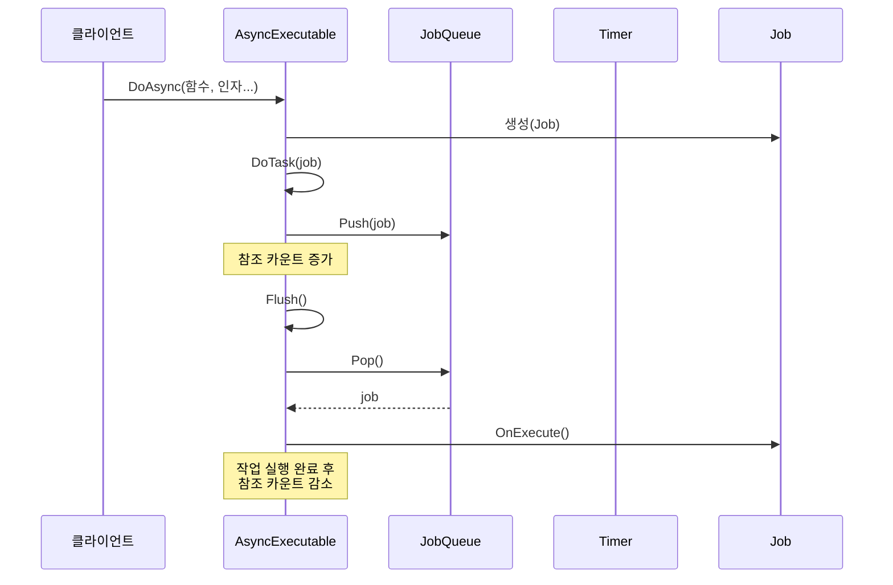

# Chapter 1: 비동기 실행기

## 소개: 왜 비동기 실행이 필요한가요?

프로그램을 개발할 때 여러 작업을 동시에 처리해야 하는 상황이 자주 발생합니다. 예를 들어, 게임에서는 캐릭터 움직임, 물리 계산, 애니메이션, 네트워크 통신 등 다양한 작업을 동시에 수행해야 합니다. 이러한 작업들을 모두 순차적으로 처리한다면 프로그램이 느려지고 사용자 경험이 저하될 수 있습니다.

여기서 **비동기 실행기**가 등장합니다. 비동기 실행기는 다음과 같은 상황에서 특히 유용합니다:

- 여러 작업을 효율적으로 관리하고 싶을 때
- 작업의 처리 순서를 제어하고 싶을 때
- 프로그램의 반응성을 유지하고 싶을 때

## 비동기 실행기 이해하기

비동기 실행기는 식당의 주방 시스템과 유사합니다. 생각해 보세요:


식당에서:
1. 고객이 음식을 주문합니다
2. 서빙 직원이 주문을 받아서 주방에 전달합니다
3. 주방에서는 주문이 들어온 순서대로(또는 우선순위에 따라) 요리를 준비합니다
4. 요리가 완성되면 고객에게 전달됩니다

이와 매우 유사하게, 비동기 실행기는:
1. 프로그램에서 작업 요청을 받습니다
2. 작업을 큐에 저장합니다
3. 시스템 자원이 가능할 때 작업을 실행합니다
4. 작업 완료 후 결과를 반환하거나 다음 작업으로 넘어갑니다

## AsyncExecutable 클래스 소개

`AsyncExecutable` 클래스는 비동기 실행의 핵심 클래스입니다. 이 클래스를 통해 다양한 작업을 비동기적으로 처리할 수 있습니다.

### 기본 구조

```cpp
class AsyncExecutable
{
public:
    AsyncExecutable() : mRemainTaskCount(0), mRefCount(0) {}
    // 기타 메서드...
private:
    JobQueue mJobQueue;
    std::atomic<int64_t> mRemainTaskCount;
    std::atomic<int32_t> mRefCount;
};
```

이 클래스의 핵심 구성 요소는 다음과 같습니다:
- `mJobQueue`: 실행할 작업들을 저장하는 큐
- `mRemainTaskCount`: 남아있는 작업의 수
- `mRefCount`: 참조 카운트 (객체가 사용 중일 때 삭제되지 않도록 보장)

## 비동기 작업 요청하기

`AsyncExecutable` 클래스를 사용하여 비동기 작업을 요청하는 방법은 다음과 같습니다:

### 즉시 실행하는 비동기 작업

```cpp
template <class T, class... Args>
void DoAsync(void (T::* memfunc)(Args...), Args&&... args)
{
    auto* job = new Job<T, Args...>(static_cast<T*>(this), memfunc, 
                                    std::forward<Args>(args)...);
    DoTask(job);
}
```

이 메서드는 즉시 실행할 비동기 작업을 요청합니다. 클래스의 멤버 함수와 필요한 인자들을 전달하면, 해당 함수가 비동기적으로 실행됩니다.

### 지연 실행하는 비동기 작업

```cpp
template <class T, class... Args>
void DoAsyncAfter(uint32_t after, void (T::* memfunc)(Args...), Args&&... args)
{
    auto* job = new Job<T, Args...>(static_cast<T*>(this), memfunc, 
                                   std::forward<Args>(args)...);
    LTimer->PushTimerJob(this, after, job);
}
```

이 메서드는 일정 시간이 지난 후에 실행할 비동기 작업을 요청합니다. `after` 매개변수는 작업이 실행되기 전까지 기다릴 시간(밀리초)을 지정합니다.

## 간단한 사용 예제

비동기 실행기를 사용하는 간단한 예제를 살펴보겠습니다:

```cpp
class GameCharacter : public AsyncExecutable
{
public:
    void Move() { 
        // 캐릭터 이동 로직
        std::cout << "캐릭터 이동 중" << std::endl; 
    }
    
    void Attack() { 
        // 공격 로직
        std::cout << "공격!" << std::endl; 
    }
};

// 사용 예
GameCharacter* character = new GameCharacter();
character->DoAsync(&GameCharacter::Move);  // 즉시 이동 명령 실행
character->DoAsyncAfter(1000, &GameCharacter::Attack);  // 1초 후 공격 명령 실행
```

이 예제에서는 `GameCharacter` 클래스가 `AsyncExecutable`을 상속받아 비동기 기능을 활용합니다. 캐릭터의 이동과 공격 기능을 비동기적으로 실행할 수 있습니다.

## 내부 구현 이해하기

비동기 실행기의 내부 동작을 이해하기 위해 작업 실행 과정을 단계별로 살펴보겠습니다:



### DoTask 메서드 분석

`DoTask` 메서드는 비동기 실행기의 핵심 메서드로, 작업을 큐에 등록하고 실행하는 역할을 합니다:

```cpp
void DoTask(JobEntry* task)
{
    if (mRemainTaskCount.fetch_add(1) != 0)
    {
        // 이미 작업 중이면 큐에 작업 추가
        mJobQueue.Push(task);
    }
    else
    {
        // 첫 작업이면 큐에 추가하고 실행 시작
        mJobQueue.Push(task);
        AddRefForThis(); // 참조 카운트 증가
        
        // 현재 스레드 점유 상태 확인 및 처리
        // ...생략...
    }
}
```

이 메서드는 다음과 같은 핵심 작업을 수행합니다:

1. 남은 작업 수 증가 (`mRemainTaskCount`)
2. 작업을 큐에 등록
3. 참조 카운트 관리로 객체 안전성 보장
4. 작업 실행 조건 확인 및 실행

### Flush 메서드

`Flush` 메서드는 큐에 등록된 모든 작업을 실행합니다:

```cpp
void Flush()
{
    while (true)
    {
        if (JobEntry* job = mJobQueue.Pop())
        {
            job->OnExecute();
            delete job;

            if (mRemainTaskCount.fetch_sub(1) == 1)
                break;
        }
    }
}
```

이 메서드는:
1. 작업 큐에서 작업을 꺼냅니다
2. 작업을 실행합니다
3. 작업 메모리를 해제합니다
4. 남은 작업 수를 감소시킵니다
5. 모든 작업이 완료되면 루프를 종료합니다

## 참조 카운팅 시스템

비동기 실행기는 참조 카운팅 시스템을 사용하여 작업 실행 중에 객체가 삭제되지 않도록 보장합니다:

```cpp
void AddRefForThis()
{
    mRefCount.fetch_add(1);
}

void ReleaseRefForThis()
{
    mRefCount.fetch_sub(1);
}
```

이 시스템은:
1. 작업을 시작할 때 참조 카운트를 증가시킵니다
2. 작업이 완료될 때 참조 카운트를 감소시킵니다
3. 참조 카운트가 0이 되면 객체가 안전하게 삭제될 수 있음을 보장합니다

## 요약 및 다음 단계

이번 장에서는 비동기 실행기의 기본 개념과 사용법에 대해 배웠습니다. 비동기 실행기는 다양한 작업을 효율적으로 관리하고 시스템 자원을 최적화하는 데 도움이 되는 강력한 도구입니다.

주요 내용:
- 비동기 실행기의 필요성과 개념
- `AsyncExecutable` 클래스 구조
- 비동기 작업 요청 방법
- 내부 구현 및 작동 원리

다음 장인 [작업 (Job)](02_작업__job__.md)에서는 비동기 실행기에서 처리하는 작업의 구조와 특성에 대해 자세히 알아보겠습니다. 작업이 어떻게 정의되고 실행되는지, 그리고 어떻게 비동기 시스템의 기본 단위로 작동하는지 배우게 될 것입니다.

---

Generated by [AI Codebase Knowledge Builder](https://github.com/The-Pocket/Tutorial-Codebase-Knowledge)