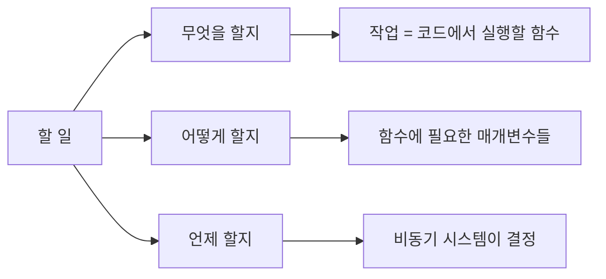
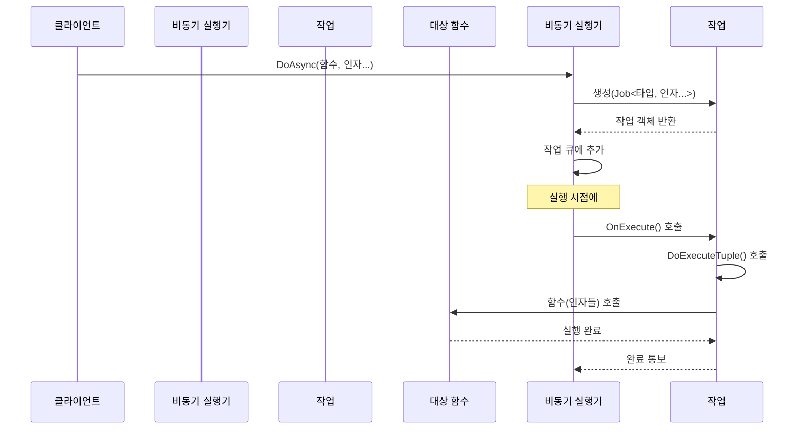

# Chapter 2: 작업 (Job)

[비동기 실행기](01_비동기_실행기_.md) 장에서 배운 내용을 바탕으로, 이제 비동기 시스템의 핵심 요소인 '작업(Job)'에 대해 알아보겠습니다. 작업은 비동기 실행기가 관리하고 실행하는 가장 기본적인 단위입니다.

## 작업(Job)이란 무엇인가?

현실 세계에서 할 일 목록을 생각해보세요. 각 항목은 나중에 수행할 특정 작업을 나타냅니다. 프로그래밍에서 작업(Job)도 이와 유사합니다. 작업은 나중에 실행할 수 있도록 함수와 필요한 데이터를 함께 저장해둔 패키지입니다.



실생활 예시로 생각해보면, 친구에게 "내일 오후 3시에 커피숍에서 만나자"라고 메시지를 보내는 것과 비슷합니다. 이 메시지는:
- 무엇을: 만남
- 어떻게: 커피숍에서 
- 언제: 내일 오후 3시

이런 정보를 담고 있습니다. 프로그램의 작업(Job)도 동일한 개념입니다.

## 작업(Job)의 구조 이해하기

`Dispatcher` 프로젝트에서 작업은 다음과 같은 기본 구조로 되어 있습니다:

```cpp
struct JobEntry
{
  JobEntry() {}
  virtual ~JobEntry() {}

  virtual void OnExecute() {}

  NodeEntry mNodeEntry;
};
```

이 코드는 모든 작업의 기본 구조를 정의합니다. `OnExecute()` 메서드는 작업이 실행될 때 호출되는 함수입니다. 모든 작업은 이 기본 구조를 확장하여 실제 수행할 기능을 구현합니다.

## 템플릿을 사용한 작업 구현

실제 작업은 템플릿을 사용하여 구현됩니다:

```cpp
template <class ObjType, class... ArgTypes>
struct Job : public JobEntry, ObjectPool<Job<ObjType, ArgTypes...>>
{
  Job(ObjType* obj, MemFunc_ memfunc, ArgTypes&&... args)
    : mObject(obj), mMemFunc(memfunc), mArgs(std::forward<ArgTypes>(args)...)
  {}

  virtual void OnExecute()
  {
    DoExecuteTuple(mObject, mMemFunc, mArgs);
  }

  // 멤버 변수들...
};
```

이 코드는 복잡해 보이지만, 실제로는 간단한 개념을 구현하고 있습니다:

1. `ObjType`: 호출할 함수를 가진 객체의 타입
2. `ArgTypes`: 함수에 전달할 매개변수 타입들
3. `OnExecute()`: 실제 함수를 호출하는 부분

예를 들어, `Player` 객체의 `Move(int x, int y)` 함수를 호출하는 작업은 `Job<Player, int, int>` 타입이 됩니다.

## 작업을 사용하는 방법

작업을 직접 생성하고 사용하는 예제를 살펴보겠습니다:

```cpp
class Player {
public:
  void Move(int x, int y) {
    std::cout << "플레이어가 (" << x << ", " << y << ")로 이동합니다." << std::endl;
  }
};

// 작업 생성 및 실행
Player* player = new Player();
auto* job = new Job<Player, int, int>(player, &Player::Move, 10, 20);
job->OnExecute(); // 출력: 플레이어가 (10, 20)로 이동합니다.
delete job;
```

하지만 실제로는 작업을 직접 생성하고 관리하는 것보다 [비동기 실행기](01_비동기_실행기_.md)가 제공하는 편리한 방법을 사용합니다:

```cpp
class GamePlayer : public AsyncExecutable {
public:
  void Move(int x, int y) {
    std::cout << "플레이어가 (" << x << ", " << y << ")로 이동합니다." << std::endl;
  }
};

// 비동기 실행기를 통한 작업 생성
GamePlayer* player = new GamePlayer();
player->DoAsync(&GamePlayer::Move, 10, 20);
```

이 방식이 훨씬 간결하고 사용하기 쉽습니다. 비동기 실행기가 내부적으로 작업을 생성하고 관리해주기 때문입니다.

## 튜플 언패킹의 마법

작업이 내부적으로 어떻게 함수와 매개변수를 저장하고 실행하는지 이해하려면 '튜플 언패킹'이라는 개념을 알아야 합니다. 튜플은 여러 타입의 값을 하나의 객체에 저장할 수 있는 자료구조입니다.

```cpp
// 튜플 예제
std::tuple<int, std::string, double> myTuple(42, "안녕하세요", 3.14);
```

작업은 함수 매개변수를 튜플에 저장하고, 실행 시점에 이 튜플을 '언패킹'하여 함수를 호출합니다:

```cpp
template <int N>
struct TupleUnpacker
{
  template <class ObjType, class... FuncArgs, class... TupleArgs, class... Args>
  static void DoExecute(ObjType* obj, void (ObjType::*memfunc)(FuncArgs...),
                        const std::tuple<TupleArgs...>& targ, Args&&... args)
  {
    // 재귀적으로 튜플 요소를 언패킹
    TupleUnpacker<N - 1>::DoExecute(obj, memfunc, targ, 
                                     std::get<N - 1>(targ), 
                                     std::forward<Args>(args)...);
  }
};
```

이 코드는 복잡해 보이지만, 한 번에 하나씩 튜플 요소를 함수 인자로 변환하는 과정입니다. 마치 선물 상자를 하나씩 풀어 내용물을 꺼내는 것과 같습니다.

## 작업 실행 흐름 이해하기

작업이 어떻게 생성되고 실행되는지 단계별로 살펴보겠습니다:



실제 코드에서 이 흐름은 다음과 같습니다:

1. 클라이언트가 `DoAsync()` 호출
2. `DoAsync()`는 새 작업 객체 생성
3. 작업은 큐에 추가됨
4. 실행 시점에 작업의 `OnExecute()` 호출
5. `OnExecute()`는 `DoExecuteTuple()`를 사용해 함수 호출
6. 함수가 실행되고 작업 완료

## 작업과 객체 풀

성능 향상을 위해 `Job` 클래스는 [객체 풀](07_객체_풀_.md)을 사용합니다:

```cpp
template <class ObjType, class... ArgTypes>
struct Job : public JobEntry, ObjectPool<Job<ObjType, ArgTypes...>>
{
    // ...
};
```

객체 풀은 작업 객체를 재사용하여 메모리 할당/해제 비용을 절감합니다. 이에 대한 자세한 내용은 [객체 풀](07_객체_풀_.md) 장에서 설명합니다.

## 실전 예제: 게임 캐릭터 제어하기

실제 게임 프로그래밍에서 작업을 어떻게 활용할 수 있는지 예제를 통해 알아보겠습니다:

```cpp
class GameCharacter : public AsyncExecutable
{
public:
  void Move(int x, int y) {
    std::cout << "캐릭터가 (" << x << ", " << y << ")로 이동" << std::endl;
  }
  
  void Attack(int targetId) {
    std::cout << "대상 " << targetId << "을 공격" << std::endl;
  }
  
  void PlayAnimation(std::string animName) {
    std::cout << animName << " 애니메이션 재생" << std::endl;
  }
};
```

이 캐릭터를 제어하는 코드를 작성해보겠습니다:

```cpp
GameCharacter* hero = new GameCharacter();

// 즉시 이동 명령
hero->DoAsync(&GameCharacter::Move, 100, 200);

// 0.5초 후 공격 명령
hero->DoAsyncAfter(500, &GameCharacter::Attack, 42);

// 1초 후 애니메이션 재생
hero->DoAsyncAfter(1000, &GameCharacter::PlayAnimation, "Victory");
```

이 코드는 캐릭터에게 여러 작업을 지시하고, 시스템이 적절한 시간에 각 작업을 실행하도록 합니다. 게임 개발자는 작업의 세부 실행 방식에 신경 쓰지 않고, 게임플레이에 집중할 수 있습니다.

## 작업 활용 팁

효과적인 작업 활용을 위한 몇 가지 팁을 소개합니다:

1. **간결한 작업 설계**: 하나의 작업은 하나의 명확한 기능만 수행하도록 설계하세요.
2. **작업 조합**: 복잡한 기능은 여러 작업의 조합으로 구현하세요.
3. **작업 우선순위**: 중요한 작업은 [작업 큐](03_작업_큐_.md)에서 우선적으로 처리되도록 설계하세요.
4. **오류 처리**: 작업 실행 중 발생할 수 있는 예외 상황을 고려하세요.
5. **자원 관리**: 작업이 사용하는 자원(메모리, 파일 등)을 적절히 관리하세요.

## 요약 및 다음 단계

이번 장에서는 `Dispatcher` 프로젝트의 핵심 개념인 '작업(Job)'에 대해 배웠습니다. 작업은 비동기 시스템에서 나중에 실행할 함수와 매개변수를 패키징하는 방법을 제공합니다. 튜플 언패킹을 통해 다양한 타입과 개수의 매개변수를 가진 함수도 쉽게 호출할 수 있습니다.

배운 내용을 요약하면:
- 작업(Job)은 나중에 실행할 함수와 매개변수를 함께 저장하는 객체입니다.
- 템플릿과 튜플 언패킹을 사용하여 다양한 함수와 매개변수를 지원합니다.
- 비동기 실행기는 작업을 큐에 추가하고 적절한 시점에 실행합니다.
- 객체 풀을 사용하여 작업 객체의 생성과 소멸에 따른 성능 저하를 방지합니다.

다음 장인 [작업 큐](03_작업_큐_.md)에서는 작업들이 어떻게 저장되고 관리되는지, 그리고 어떤 순서로 실행되는지 자세히 알아보겠습니다. 작업 큐는 비동기 시스템의 효율성과 응답성을 결정하는 중요한 요소입니다.

---

Generated by [AI Codebase Knowledge Builder](https://github.com/The-Pocket/Tutorial-Codebase-Knowledge)