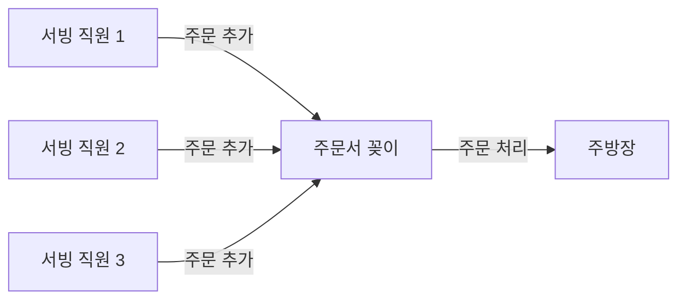
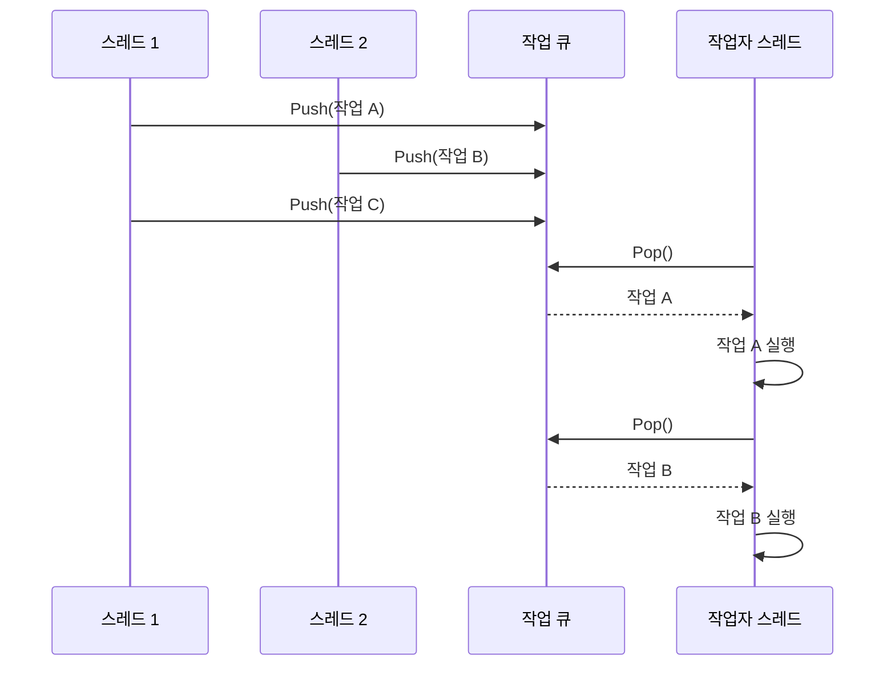

# Chapter 3: 작업 큐
[작업 (Job)](02_작업__job__.md) 장에서 우리는 비동기 시스템에서 실행할 함수와 매개변수를 패키징하는 방법에 대해 배웠습니다. 이번 장에서는 이러한 작업들을 어떻게 저장하고 관리하는지, 즉 '작업 큐(Job Queue)'에 대해 알아보겠습니다.
  

## 작업 큐가 필요한 이유
소프트웨어가 복잡해질수록 여러 작업을 동시에 처리해야 할 필요성이 커집니다. 예를 들어, 게임에서는 플레이어 입력 처리, 물리 엔진 계산, AI 업데이트, 렌더링 등 수많은 작업이 동시에 발생합니다.

이런 상황에서 작업 큐는 '대기 중인 작업'을 체계적으로 관리하는 도구입니다. 마치 식당의 주문서 꽂이와 같습니다:



여러 서빙 직원(스레드)이 주문서(작업)를 꽂이(큐)에 추가하고, 주방장(처리 스레드)이 하나씩 꺼내서 처리합니다.
  

## 작업 큐의 특성 이해하기
작업 큐의 가장 중요한 특성은 '스레드 안전성(Thread Safety)'입니다. 이것은 여러 스레드가 동시에 큐에 접근해도 문제가 발생하지 않도록 보장합니다.

두 번째 중요한 특성은 '멀티 프로듀서, 싱글 컨슈머(Multi-Producer, Single-Consumer)' 패턴입니다:

- **멀티 프로듀서**: 여러 스레드가 동시에 작업을 큐에 추가할 수 있습니다.
- **싱글 컨슈머**: 오직 하나의 스레드만 큐에서 작업을 꺼내 처리합니다.

이는 마치 여러 고객이 동시에 티켓 발급기에 요청을 넣을 수 있지만, 직원은 한 명씩만 티켓을 처리하는 것과 같습니다.
  

## 작업 큐의 기본 구조
`Dispatcher` 프로젝트의 작업 큐는 다음과 같은 기본 구조를 가집니다:

```cpp
class JobQueue
{
public:
  JobQueue() : mHead(&mStub), mTail(&mStub)
  {
    mOffset = offsetof(struct JobEntry, mNodeEntry);
    _ASSERT_CRASH(mHead.is_lock_free());
  }
  
  // 작업 추가 및 꺼내기 메서드들...
  
private:
  std::atomic<NodeEntry*> mHead;
  NodeEntry* mTail;
  NodeEntry mStub;
  int64_t mOffset;
};
```

이 코드의 핵심 구성 요소는 다음과 같습니다:
- `mHead`: 큐의 머리 부분을 가리키는 포인터 (작업 추가)
- `mTail`: 큐의 꼬리 부분을 가리키는 포인터 (작업 꺼내기)
- `mStub`: 빈 큐 상태를 표시하기 위한 더미 노드
- `mOffset`: 노드 항목에서 작업 항목을 계산하기 위한 오프셋

## 작업 큐 사용하기
작업 큐의 기본 사용법은 매우 간단합니다:

### 작업 추가하기 (Push)

```cpp
JobQueue queue;
JobEntry* job = new Job<Player, int, int>(player, &Player::Move, 10, 20);
queue.Push(job);
```

이 코드는 작업 큐에 새로운 작업을 추가합니다. 여러 스레드에서 동시에 이 코드를 실행해도 안전합니다.

### 작업 꺼내기 (Pop)

```cpp
JobQueue queue;
// ...작업들이 이미 추가된 상태...
JobEntry* job = queue.Pop();
if (job) {
  job->OnExecute();  // 작업 실행
  delete job;        // 작업 메모리 해제
}
```

이 코드는 큐에서 하나의 작업을 꺼내 실행합니다. 이 코드는 한 번에 하나의 스레드에서만 실행해야 합니다.

## 작업 큐의 내부 구현
작업 큐는 '무잠금(Lock-Free)' 알고리즘을 사용하여 구현됩니다. 이는 전통적인 뮤텍스(Mutex)나 세마포어(Semaphore) 같은 동기화 기법 대신, 원자적 연산(Atomic Operations)을 사용하여 스레드 안전성을 보장합니다.

### 작업 추가 구현 (Push)

```cpp
void Push(JobEntry* newData)
{
  NodeEntry* prevNode = (NodeEntry*)std::atomic_exchange_explicit(&mHead,
    &newData->mNodeEntry, std::memory_order_acq_rel);

  prevNode->mNext = &(newData->mNodeEntry);
}
```

이 코드는 원자적 교환 연산을 사용하여 큐의 머리 부분에 새 작업을 추가합니다. 간단히 설명하면:

1. 새 작업의 노드를 큐의 머리로 설정합니다 (원자적 교환).
2. 이전 머리 노드가 새 노드를 가리키도록 합니다.

이렇게 함으로써 여러 스레드가 동시에 작업을 추가해도 충돌이 발생하지 않습니다.
  

### 작업 꺼내기 구현 (Pop)
작업 꺼내기는 조금 더 복잡합니다:

```cpp
JobEntry* Pop()
{
  NodeEntry* tail = mTail;
  NodeEntry* next = tail->mNext;

  // 큐가 비어있는 경우 처리
  if (tail == &mStub) {
    if (nullptr == next)
      return nullptr;
    // 첫 번째 팝 처리
    mTail = next;
    tail = next;
    next = next->mNext;
  }

  // 일반적인 경우 처리
  if (next) {
    mTail = next;
    return reinterpret_cast<JobEntry*>(
           reinterpret_cast<int64_t>(tail) - mOffset);
  }

  // 나머지 케이스 처리...
}
```

이 코드는 큐의 꼬리 부분에서 작업을 꺼냅니다. 여러 특수 케이스를 처리해야 하므로 조금 복잡해 보이지만, 핵심 아이디어는 간단합니다:

1. 꼬리 노드의 다음 노드를 확인합니다.
2. 다음 노드가 있으면 꺼내고 꼬리를 업데이트합니다.
3. 특수 케이스(빈 큐, 마지막 항목 등)를 처리합니다.
  

## 작업 큐 작동 원리 - 단계별 설명
작업 큐의 작동 과정을 사람을 예로 들어 설명해보겠습니다:



이 다이어그램은 여러 스레드가 동시에 작업을 추가하고, 작업자 스레드가 순서대로 작업을 꺼내 실행하는 과정을 보여줍니다.
  

## 실제 코드 내부 동작 - 무잠금 구현
무잠금 큐의 핵심 아이디어는 원자적 연산을 사용하여 락(Lock) 없이도 스레드 안전성을 보장하는 것입니다.

```cpp
// 원자적 교환 연산
NodeEntry* prevNode = (NodeEntry*)std::atomic_exchange_explicit(&mHead,
  &newData->mNodeEntry, std::memory_order_acq_rel);
```

이 코드의 `std::atomic_exchange_explicit` 함수는 원자적으로(중간에 끊기지 않게) 두 값을 교환합니다. 이것은 여러 스레드가 동시에 이 코드를 실행해도 충돌이 발생하지 않도록 보장합니다.

메모리 순서(memory order)는 멀티스레드 환경에서 메모리 연산의 순서를 제어합니다:
- `std::memory_order_acq_rel`은 현재 연산이 이전 연산의 결과를 볼 수 있고(acquire), 다음 연산이 현재 연산의 결과를 볼 수 있음(release)을 보장합니다.
  

## 다양한 사용 예제

### 게임 엔진에서의 사용 예

```cpp
class GameEngine {
private:
  JobQueue mRenderQueue;
  JobQueue mPhysicsQueue;
  
public:
  void AddRenderJob(RenderJob* job) {
    mRenderQueue.Push(job);
  }
  
  void ProcessRenderJobs() {
    while (JobEntry* job = mRenderQueue.Pop()) {
      job->OnExecute();
      delete job;
    }
  }
};
```

이 예제는 게임 엔진에서 렌더링 작업과 물리 작업을 별도의 큐로 관리하는 방법을 보여줍니다.

### 대용량 데이터 처리에서의 사용 예

```cpp
class DataProcessor {
private:
  JobQueue mProcessQueue;
  
public:
  void AddDataChunk(DataChunk* chunk) {
    auto* job = new ProcessDataJob(chunk);
    mProcessQueue.Push(job);
  }
  
  void StartProcessing() {
    while (true) {
      JobEntry* job = mProcessQueue.Pop();
      if (!job) break;
      job->OnExecute();
      delete job;
    }
  }
};
```

이 예제는 대용량 데이터를 처리하는 시스템에서 작업 큐를 활용하는 방법을 보여줍니다.

## 작업 큐와 비동기 실행기의 연결

[비동기 실행기](01_비동기_실행기_.md)는 내부적으로 작업 큐를 사용하여 작업을 관리합니다:

```cpp
class AsyncExecutable {
private:
  JobQueue mJobQueue;
  // 기타 멤버 변수...
  
public:
  template <class T, class... Args>
  void DoAsync(void (T::* memfunc)(Args...), Args&&... args) {
    auto* job = new Job<T, Args...>(/*...*/)
    mJobQueue.Push(job);
    // 기타 처리...
  }
  
  void Flush() {
    while (JobEntry* job = mJobQueue.Pop()) {
      job->OnExecute();
      delete job;
      // 기타 처리...
    }
  }
};
```

이 코드는 [비동기 실행기](01_비동기_실행기_.md)가 작업 큐를 사용하여 작업을 관리하는 방법을 보여줍니다. `DoAsync()` 메서드는 작업을 큐에 추가하고, `Flush()` 메서드는 큐에서 작업을 꺼내 실행합니다.
  

## 실제 구현 시 주의사항
작업 큐를 직접 구현할 때 고려해야 할 몇 가지 주의사항:

1. **원자적 연산**: 스레드 안전성을 위해 원자적 연산을 올바르게 사용해야 합니다.
2. **메모리 순서**: 멀티스레드 환경에서 메모리 순서를 신중하게 고려해야 합니다.
3. **특수 케이스 처리**: 빈 큐, 단일 항목 큐 등 특수 케이스를 모두 고려해야 합니다.
4. **메모리 관리**: 작업 객체의 메모리 할당 및 해제를 신중하게 관리해야 합니다.
  

## 작업 큐의 장단점

### 장점
- 멀티스레드 환경에서 효율적인 작업 관리
- 락(Lock)이 없어 성능 병목이 줄어듦
- 생산자와 소비자 간의 분리로 시스템 구조 단순화

### 단점
- 구현이 복잡하고 오류가 발생하기 쉬움
- 디버깅이 어려움
- 특수 케이스 처리가 필요함
  

## 요약 및 다음 단계
이번 장에서는 작업 큐의 기본 개념과 구현 방법에 대해 배웠습니다. 작업 큐는 여러 스레드에서 작업을 추가하고 단일 스레드에서 작업을 처리하는 멀티 프로듀서, 싱글 컨슈머 패턴을 지원합니다. 무잠금 알고리즘을 사용하여 스레드 안전성을 보장하면서도 높은 성능을 제공합니다.

작업 큐의 주요 특징:
- 스레드 안전한 작업 관리
- 무잠금 알고리즘으로 성능 향상
- 멀티 프로듀서, 싱글 컨슈머 패턴 지원

다음 장인 [작업 디스패처](04_작업_디스패처_.md)에서는 작업 큐를 활용하여 작업을 효율적으로 분배하고 실행하는 방법에 대해 알아보겠습니다. 작업 디스패처는 여러 작업 큐를 관리하고 작업을 적절한 스레드에 할당하는 역할을 합니다.

---

Generated by [AI Codebase Knowledge Builder](https://github.com/The-Pocket/Tutorial-Codebase-Knowledge)