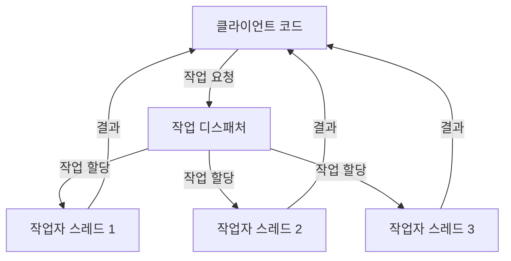
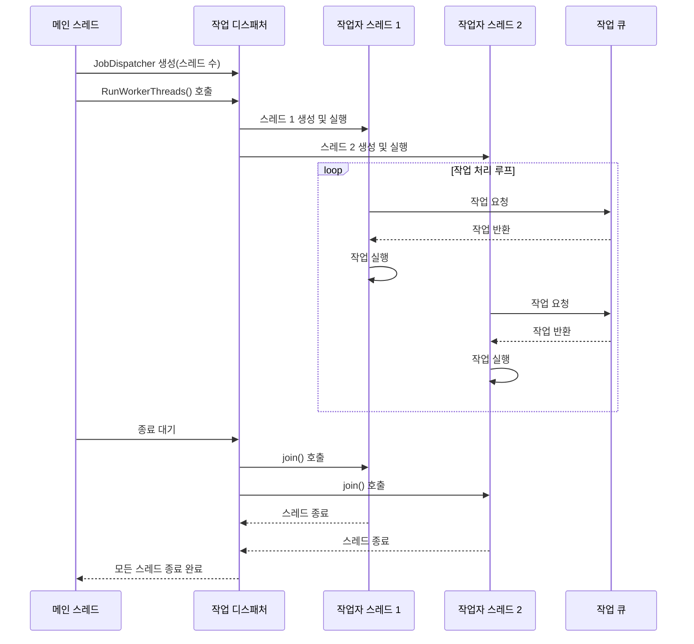
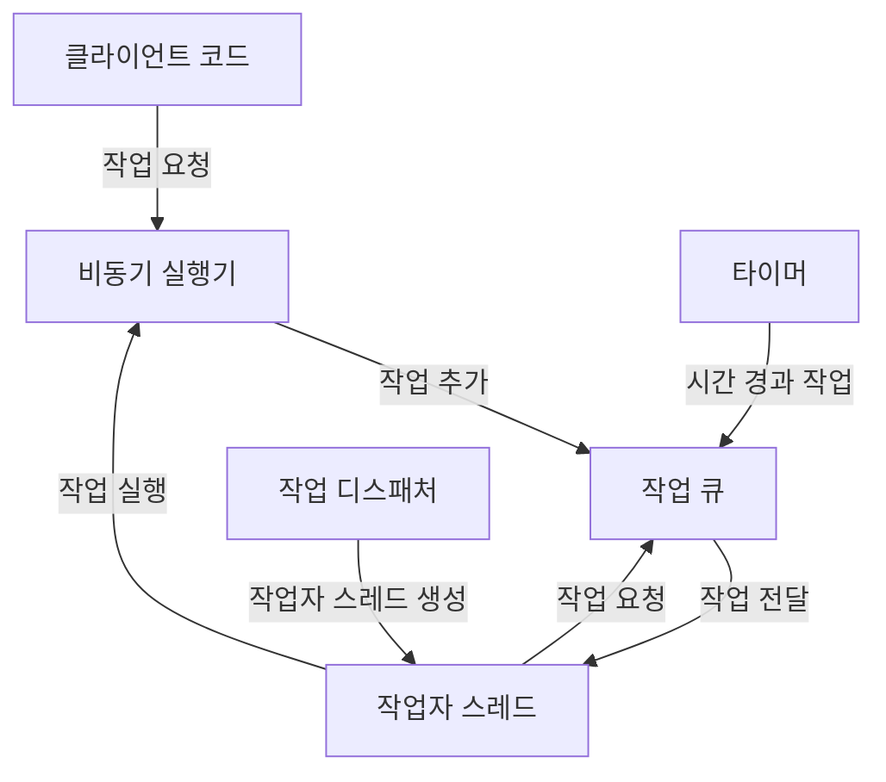

# Chapter 4: 작업 디스패처
[작업 큐](03_작업_큐_.md) 장에서 우리는 비동기 작업을 저장하고 관리하는 방법에 대해 배웠습니다. 이번 장에서는 이러한 작업들을 여러 스레드에 효율적으로 분배하는 '작업 디스패처(Job Dispatcher)'에 대해 알아보겠습니다.
  

## 작업 디스패처가 필요한 이유
현대적인 소프트웨어 개발에서 멀티코어 CPU의 성능을 최대한 활용하기 위해 작업을 여러 스레드에 분산하는 것이 중요합니다. 하지만 개발자가 직접 각 작업을 특정 스레드에 할당하고 관리하는 것은 매우 복잡하고 오류가 발생하기 쉽습니다.

작업 디스패처는 이런 문제를 해결합니다. 마치 회사의 관리자가 직원들에게 업무를 분배하는 것처럼, 작업 디스패처는 작업을 여러 작업자 스레드에 효율적으로 분배합니다.


  

## 작업 디스패처의 핵심 개념

### 템플릿 기반 디자인
`Dispatcher` 프로젝트의 작업 디스패처는 템플릿 클래스로 설계되어 있어, 다양한 종류의 작업자 스레드를 지원할 수 있습니다:

```cpp
template <class T>
class JobDispatcher
{
public:
    JobDispatcher(int workerCount) : mWorkerThreadCount(workerCount)
    {
        // T는 Runnable을 상속해야 함
        static_assert(true == std::is_convertible<T*, Runnable*>::value, 
                     "only allowed when Runnable");
    }
    
    // 메서드들...
};
```

이 코드에서 `T`는 작업자 스레드의 타입을 나타냅니다. `static_assert`는 `T`가 `Runnable` 인터페이스를 구현하는지 컴파일 시점에 확인합니다. 이렇게 함으로써 다양한 종류의 작업자 스레드를 사용할 수 있으면서도 모든 작업자가 필요한 기능을 구현하도록 보장합니다.

### 작업자 스레드 관리
작업 디스패처는 여러 작업자 스레드를 생성하고 관리합니다:

```cpp
void RunWorkerThreads()
{
    for (int i = 0; i < mWorkerThreadCount; ++i)
    {
        mWorkerThreadList.emplace_back(
            std::thread(&T::ThreadRun, std::make_unique<T>()));
    }
    
    // 모든 스레드가 종료될 때까지 대기
    for (auto& thread : mWorkerThreadList)
    {
        if (thread.joinable())
            thread.join();
    }
}
```

이 메서드는 두 가지 주요 작업을 수행합니다:
1. 지정된 수만큼 작업자 스레드를 생성합니다
2. 모든 스레드가 작업을 완료할 때까지 대기합니다

각 작업자 스레드는 `T`의 인스턴스를 생성하고 `ThreadRun` 메서드를 실행합니다.
  

## 작업 디스패처 사용하기
작업 디스패처를 사용하는 방법은 매우 간단합니다. 먼저 작업자 스레드 클래스를 정의한 다음, 작업 디스패처를 생성하고 실행합니다.
  

### 작업자 스레드 클래스 정의하기

```cpp
class TestWorkerThread : public Runnable
{
public:
    virtual void ThreadRun() override
    {
        while (!mShouldStop)
        {
            // 작업 처리 로직
            ProcessJobs();
            
            // 잠시 대기
            std::this_thread::sleep_for(std::chrono::milliseconds(10));
        }
    }
    
    // 기타 메서드들...
};
```

이 코드는 `Runnable` 인터페이스를 구현하는 작업자 스레드 클래스를 정의합니다. `ThreadRun` 메서드는 스레드의 주요 실행 루프를 구현합니다. 이 메서드는 스레드가 중지 신호를 받을 때까지 계속해서 작업을 처리합니다.
  

### 작업 디스패처 생성 및 실행하기

```cpp
int main()
{
    // 4개의 작업자 스레드로 디스패처 생성
    JobDispatcher<TestWorkerThread> dispatcher(4);
    
    // 작업자 스레드 실행 시작
    dispatcher.RunWorkerThreads();
    
    return 0;
}
```

이 코드는 4개의 `TestWorkerThread` 인스턴스를 생성하는 작업 디스패처를 만들고, 작업자 스레드들을 실행하기 시작합니다. `RunWorkerThreads` 메서드는 모든 작업자 스레드가 종료될 때까지 반환하지 않습니다.
  

## 작업 디스패처의 내부 동작

작업 디스패처가 어떻게 작동하는지 단계별로 살펴보겠습니다:



이 다이어그램은 작업 디스패처가 작업자 스레드를 생성하고 관리하는 과정을 보여줍니다. 각 작업자 스레드는 [작업 큐](03_작업_큐_.md)에서 작업을 가져와 실행합니다.
  

### 스레드 생성 및 실행
작업 디스패처는 `RunWorkerThreads` 메서드에서 작업자 스레드를 생성하고 실행합니다:

```cpp
for (int i = 0; i < mWorkerThreadCount; ++i)
{
    mWorkerThreadList.emplace_back(
        std::thread(&T::ThreadRun, std::make_unique<T>()));
}
```

이 코드는 다음과 같은 작업을 수행합니다:

1. `std::make_unique<T>()`를 사용하여 새 작업자 인스턴스를 생성합니다
2. `std::thread` 생성자에 작업자의 `ThreadRun` 메서드와 작업자 인스턴스를 전달합니다
3. 생성된 스레드를 `mWorkerThreadList`에 추가합니다
  

### 스레드 대기 및 종료
모든 작업자 스레드가 생성된 후, 디스패처는 각 스레드가 종료될 때까지 대기합니다:

```cpp
for (auto& thread : mWorkerThreadList)
{
    if (thread.joinable())
        thread.join();
}
```

`thread.join()` 호출은 해당 스레드가 종료될 때까지 현재 스레드(메인 스레드)를 차단합니다. 이렇게 함으로써 모든 작업자 스레드가
작업을 완료할 때까지 메인 스레드가 종료되지 않도록 보장합니다.
  

## 작업자 스레드의 구현
작업자 스레드는 `Runnable` 인터페이스를 구현해야 합니다. 이 인터페이스는 [실행 가능 인터페이스](06_실행_가능_인터페이스_.md) 장에서 자세히 다룹니다.

```cpp
class Runnable
{
public:
    virtual void ThreadRun() = 0;
    virtual void Stop() { mShouldStop = true; }
    
protected:
    bool mShouldStop = false;
};
```

작업자 스레드 클래스는 `ThreadRun` 메서드를 구현하여 스레드의 메인 루프를 정의해야 합니다:

```cpp
class GameWorkerThread : public Runnable
{
public:
    virtual void ThreadRun() override
    {
        while (!mShouldStop)
        {
            // 게임 작업 처리
            ProcessGameJobs();
            
            // 작업 없을 때 잠시 대기
            if (IsQueueEmpty())
                std::this_thread::sleep_for(std::chrono::milliseconds(1));
        }
    }
    
    // 기타 메서드들...
};
```

이 예제에서 `GameWorkerThread`는 게임 관련 작업을 처리하는 작업자 스레드 클래스입니다. `ThreadRun` 메서드는 중지 신호를 받을 때까지 계속해서 게임 작업을 처리합니다.
  

## 작업 디스패처의 실전 예제
게임 엔진에서 작업 디스패처를 사용하는 예제를 살펴보겠습니다:

```cpp
// 게임 작업자 스레드 정의
class GameWorker : public Runnable
{
public:
    virtual void ThreadRun() override
    {
        while (!mShouldStop)
        {
            // AI, 물리, 애니메이션 등의 작업 처리
            ProcessGameJobs();
        }
    }
};

// 메인 함수에서 사용
int main()
{
    // 하드웨어 스레드 수-1개의 작업자 생성
    int workerCount = std::thread::hardware_concurrency() - 1;
    JobDispatcher<GameWorker> gameDispatcher(workerCount);
    
    // 작업자 스레드 시작
    gameDispatcher.RunWorkerThreads();
    
    return 0;
}
```

이 예제는 게임 엔진에서 작업 디스패처를 사용하는 방법을 보여줍니다. 시스템의 하드웨어 스레드 수에서 1을 뺀 만큼의 작업자 스레드를 생성합니다(메인 스레드를 위해 하나 남겨둠).
  

## 작업 디스패처와 기타 모듈의 연결
작업 디스패처는 [작업 큐](03_작업_큐_.md), [타이머](05_타이머_.md), [비동기 실행기](01_비동기_실행기_.md) 등 다른 모듈과 함께 동작합니다:



작업 디스패처는 작업자 스레드를 생성하고 관리하는 반면, 실제 작업은 [작업 큐](03_작업_큐_.md)에 저장되고 작업자 스레드에 의해 처리됩니다. [타이머](05_타이머_.md)는 시간 경과 후 실행할 작업을 작업 큐에 추가할 수 있습니다.
  

## 실제 구현 시 고려사항
작업 디스패처를 구현할 때 고려해야 할 몇 가지 사항:

1. **작업자 스레드 수**: 너무 많은 스레드를 생성하면 컨텍스트 스위칭 오버헤드가 증가할 수 있습니다. 일반적으로 CPU 코어 수에 맞추는 것이 좋습니다.

2. **작업 분배 전략**: 작업을 어떻게 분배할지 결정해야 합니다. 라운드 로빈, 부하 기반, 작업 타입 기반 등 다양한 전략이 있습니다.

3. **우선순위 지원**: 중요한 작업이 먼저 처리되도록 우선순위 큐를 사용할 수 있습니다.

4. **예외 처리**: 작업자 스레드에서 발생하는 예외를 적절히 처리해야 합니다.
  

## 실생활 비유로 이해하기
작업 디스패처는 식당의 매니저와 유사합니다:

1. **매니저(작업 디스패처)**: 여러 직원들을 고용하고 관리합니다.
2. **직원들(작업자 스레드)**: 실제 일을 수행합니다.
3. **주문서(작업)**: 수행해야 할 업무를 나타냅니다.
4. **주문판(작업 큐)**: 처리해야 할 주문이 쌓이는 곳입니다.

매니저는 직원들을 고용하고 업무를 할당하지만, 실제 주문을 받고 음식을 만드는 것은 직원들의 몫입니다. 직원들은 주문판에서 주문서를 하나씩 가져와 처리합니다.

## 요약 및 다음 단계

이번 장에서는 작업 디스패처의 기본 개념과 구현 방법에 대해 배웠습니다. 작업 디스패처는 여러 작업자 스레드를 관리하고 작업을 효율적으로 분배하는 역할을 합니다. 템플릿 기반 설계를 통해 다양한 종류의 작업자 스레드를 지원할 수 있습니다.

작업 디스패처의 주요 특징:
- 템플릿 기반으로 다양한 작업자 스레드 지원
- 작업자 스레드 생성 및 관리
- 멀티코어 CPU의 효율적인 활용

다음 장인 [타이머](05_타이머_.md)에서는 지연된 작업 실행을 위한 타이머 시스템에 대해 알아보겠습니다. 타이머는 특정 시간이 지난 후에 작업을 실행하는 기능을 제공하며, 작업 디스패처와 함께 사용하면 더욱 유연한 비동기 프로그래밍이 가능합니다.

---

Generated by [AI Codebase Knowledge Builder](https://github.com/The-Pocket/Tutorial-Codebase-Knowledge)