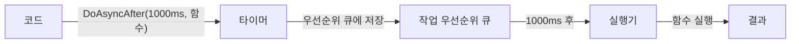
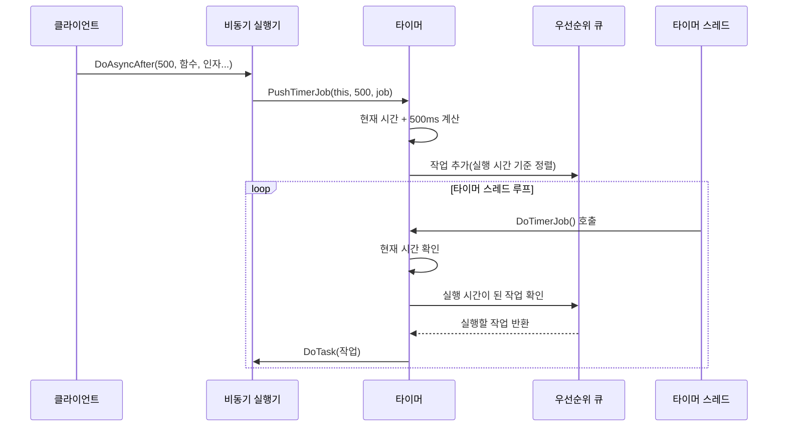
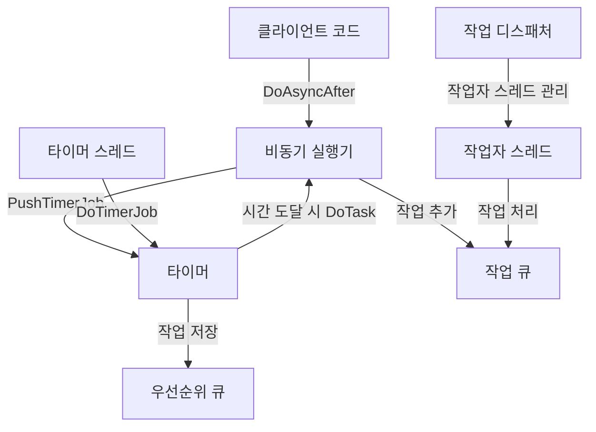

# Chapter 5: 타이머

[작업 디스패처](04_작업_디스패처_.md) 장에서 우리는 작업을 여러 스레드에 효율적으로 분배하는 방법에 대해 배웠습니다. 이번 장에서는 '언제' 작업을 실행할지 제어하는 '타이머(Timer)'에 대해 알아보겠습니다.

## 타이머가 필요한 이유

프로그래밍에서는 "나중에 실행하기"가 필요한 상황이 자주 발생합니다. 예를 들어:

- 게임에서 5초 후에 몬스터가 등장하게 하고 싶을 때
- 채팅 앱에서 메시지를 보내고 3초 후에 "읽음" 표시를 확인하고 싶을 때
- 주기적으로 데이터를 저장하는 기능을 구현하고 싶을 때

이런 상황에서 타이머는 매우 유용합니다. 실생활에서 요리사가 타이머를 설정하여 정확한 시간에 요리를 확인하는 것처럼, 프로그램도 타이머를 통해 적절한 시간에 작업을 실행할 수 있습니다.

## 타이머의 핵심 개념

타이머의 주요 개념은 다음과 같습니다:

1. **지연 실행(Delayed Execution)**: 작업을 즉시 실행하지 않고 일정 시간 후에 실행
2. **우선순위 큐(Priority Queue)**: 가장 빨리 실행해야 할 작업부터 처리
3. **시간 측정(Time Measurement)**: 정확한 시간 계산을 위한 시스템



## 타이머 사용하기

타이머를 사용하는 가장 간단한 방법은 [비동기 실행기](01_비동기_실행기_.md)의 `DoAsyncAfter` 메서드를 활용하는 것입니다:

```cpp
class Player : public AsyncExecutable {
public:
    void Move(int x, int y) {
        std::cout << "플레이어가 이동합니다." << std::endl;
    }
    
    void StartMoving() {
        // 0.5초 후에 Move 함수 실행
        DoAsyncAfter(500, &Player::Move, 10, 20);
    }
};
```

이 코드는 `Player` 클래스의 인스턴스가 `StartMoving` 메서드를 호출하면, 0.5초(500밀리초) 후에 `Move` 함수를 실행하도록 합니다. 매개변수 `10`과 `20`은 `Move` 함수에 전달됩니다.

### 여러 개의 타이머 작업 예약하기

여러 작업을 다른 시간에 실행하도록 예약할 수도 있습니다:

```cpp
void PerformAttackSequence() {
    // 즉시 준비 동작 실행
    DoAsync(&Player::PrepareAttack);
    
    // 1초 후 공격 실행
    DoAsyncAfter(1000, &Player::Attack, 1);
    
    // 2초 후 두 번째 공격 실행
    DoAsyncAfter(2000, &Player::Attack, 2);
    
    // 3초 후 마무리 동작 실행
    DoAsyncAfter(3000, &Player::FinishAttack);
}
```

이 코드는 공격 시퀀스를 시간별로 예약합니다. 각 동작이 지정된 시간에 순서대로 실행됩니다.

## 타이머의 내부 구현

타이머가 어떻게 작동하는지 이해하기 위해 단계별로 살펴보겠습니다:



이 다이어그램은 타이머가 작업을 등록하고 실행하는 과정을 보여줍니다. 주요 단계는 다음과 같습니다:

1. 클라이언트가 `DoAsyncAfter`를 호출하여 지연 실행 요청
2. 비동기 실행기가 타이머에 작업 등록
3. 타이머가 실행 시간을 계산하고 우선순위 큐에 작업 추가
4. 타이머 스레드가 주기적으로 큐를 확인하고 실행 시간이 된 작업 실행

### 타이머 작업 요소(TimerJobElement)

타이머 작업은 다음 정보를 포함하는 구조체로 표현됩니다:

```cpp
struct TimerJobElement {
    TimerJobElement(AsyncExecutable* owner, JobEntry* task, int64_t execTick)
    : mOwner(owner), mTask(task), mExecutionTick(execTick)
    {}

    AsyncExecutable* mOwner;  // 작업의 소유자
    JobEntry* mTask;          // 실행할 작업
    int64_t mExecutionTick;   // 실행 시간 틱
};
```

이 구조체는 세 가지 주요 정보를 저장합니다:
- `mOwner`: 작업을 요청한 비동기 실행기 객체
- `mTask`: 실행할 실제 작업(Job)
- `mExecutionTick`: 작업이 실행되어야 할 시간(틱 단위)

### 우선순위 큐 구현

타이머는 작업을 실행 시간 순서대로 처리하기 위해 우선순위 큐를 사용합니다:

```cpp
struct TimerJobComparator {
    bool operator()(const TimerJobElement& lhs, const TimerJobElement& rhs) {
        return lhs.mExecutionTick > rhs.mExecutionTick; 
    }
};

typedef std::priority_queue<TimerJobElement, 
                          std::vector<TimerJobElement>, 
                          TimerJobComparator> TimerJobPriorityQueue;
```

이 코드는 실행 시간이 가장 빠른 작업이 큐의 최상위에 위치하도록 우선순위 큐를 설정합니다. 비교 함수는 실행 시간이 빠른 작업이 우선순위가 높도록 구현되어 있습니다.

## 타이머 클래스 살펴보기

이제 `Timer` 클래스 자체를 살펴보겠습니다:

```cpp
class Timer {
public:  
    Timer();
    
    void PushTimerJob(AsyncExecutable* obj, uint32_t after, JobEntry* task);
    
    void DoTimerJob();

private:
    int64_t GetCurrentTick();
    
    Clock::time_point     mBeginTickPoint;
    TimerJobPriorityQueue mTimerJobQueue;
};
```

이 클래스는 세 가지 주요 메서드를 제공합니다:
- `Timer()`: 타이머 초기화 및 시작 시간 설정
- `PushTimerJob()`: 새 타이머 작업 등록
- `DoTimerJob()`: 실행 시간이 된 작업 처리

### 타이머 작업 등록하기

타이머에 작업을 등록하는 방법을 살펴보겠습니다:

```cpp
void Timer::PushTimerJob(AsyncExecutable* obj, uint32_t after, JobEntry* task) {
    obj->AddRefForThis(); // 참조 카운트 증가
    
    int64_t dueTimeTick = after + LTickCount;
    
    mTimerJobQueue.push(TimerJobElement(obj, task, dueTimeTick));
}
```

이 메서드는 다음 작업을 수행합니다:
1. 작업 소유자의 참조 카운트를 증가시켜 타이머 작업이 완료될 때까지 소유자가 삭제되지 않도록 함
2. 현재 시간에 지연 시간을 더해 실행 시간을 계산
3. 작업을 우선순위 큐에 추가

### 타이머 작업 실행하기

타이머는 주기적으로 `DoTimerJob` 메서드를 호출하여 실행 시간이 된 작업을 처리합니다:

```cpp
void Timer::DoTimerJob() {
    // 현재 시간 업데이트
    LTickCount = GetCurrentTick();
    
    while (!mTimerJobQueue.empty()) {
        const TimerJobElement& timerJobElem = mTimerJobQueue.top();
        
        // 아직 실행 시간이 되지 않은 경우
        if (LTickCount < timerJobElem.mExecutionTick)
            break;
        
        // 작업 실행
        AsyncExecutable* owner = timerJobElem.mOwner;
        owner->DoTask(timerJobElem.mTask);
        owner->ReleaseRefForThis(); // 참조 카운트 감소
        
        mTimerJobQueue.pop();
    }
    
    // CPU 사용률 최적화
    std::this_thread::sleep_for(std::chrono::milliseconds(1));
}
```

이 메서드는 다음과 같은 작업을 수행합니다:
1. 현재 시간을 확인
2. 우선순위 큐에서 가장 실행 시간이 빠른 작업을 확인
3. 실행 시간이 된 작업을 모두 처리
4. 작업 실행 후 참조 카운트 감소
5. CPU 부하 감소를 위해 짧은 대기 시간 추가

### 시간 측정 방식

타이머는 정확한 시간 측정을 위해 고해상도 시계를 사용합니다:

```cpp
typedef std::chrono::high_resolution_clock Clock;

int64_t Timer::GetCurrentTick() {
    return std::chrono::duration_cast<std::chrono::milliseconds>
           (Clock::now() - mBeginTickPoint).count();
}
```

이 코드는 타이머가 시작된 이후의 시간을 밀리초 단위로 계산합니다. 고해상도 시계를 사용하여 높은 정확도를 보장합니다.

## 타이머를 이용한 실제 예제

게임에서 몬스터의 자동 공격 시스템을 구현하는 예제를 살펴보겠습니다:

```cpp
class Monster : public AsyncExecutable {
public:
    Monster() : mHealth(100), mIsAttacking(false) {}
    
    void StartAttacking() {
        if (!mIsAttacking) {
            mIsAttacking = true;
            PerformAttack();
        }
    }
    
private:
    void PerformAttack() {
        std::cout << "몬스터가 공격합니다!" << std::endl;
        
        // 3초 후 다시 공격
        DoAsyncAfter(3000, &Monster::PerformAttack);
    }
    
    int mHealth;
    bool mIsAttacking;
};
```

이 코드는 몬스터가 `StartAttacking`을 호출하면 3초 간격으로 지속적으로 공격하는 시스템을 구현합니다. 타이머를 사용하여 주기적인 작업을 쉽게 구현할 수 있습니다.

## 타이머와 다른 모듈의 연결

타이머는 [비동기 실행기](01_비동기_실행기_.md), [작업 큐](03_작업_큐_.md), [작업 디스패처](04_작업_디스패처_.md)와 함께 작동합니다:



이 다이어그램은 타이머가 전체 시스템에서 어떻게 작동하는지 보여줍니다:
1. 클라이언트가 `DoAsyncAfter`를 호출하여 지연 실행 요청
2. 비동기 실행기가 타이머에 작업 등록
3. 타이머가 작업을 우선순위 큐에 저장
4. 타이머 스레드가 주기적으로 작업을 확인
5. 실행 시간이 된 작업을 비동기 실행기의 작업 큐에 추가
6. 작업자 스레드가 작업을 처리

## 타이머 활용 팁

타이머를 효과적으로 활용하기 위한 몇 가지 팁:

1. **적절한 지연 시간 선택**: 너무 짧은 지연 시간은 시스템에 부담을 줄 수 있습니다.
2. **주기적 작업 설계**: 자기 자신을 다시 예약하는 방식으로 주기적 작업을 쉽게 구현할 수 있습니다.
3. **참조 카운트 관리**: 타이머 작업이 실행되기 전에 객체가 삭제되지 않도록 참조 카운트를 적절히 관리해야 합니다.
4. **오류 처리**: 타이머 작업 실행 중 발생할 수 있는 예외를 적절히 처리해야 합니다.

## 요약 및 다음 단계

이번 장에서는 타이머의 기본 개념과 구현 방법에 대해 배웠습니다. 타이머는 지정된 시간 후에 작업을 실행할 수 있게 해주는 시스템으로, 우선순위 큐를 사용하여 실행 시간이 가까운 작업부터 처리합니다. 클라이언트는 `DoAsyncAfter` 메서드를 사용하여 쉽게 지연 실행을 요청할 수 있습니다.

타이머의 주요 특징:
- 지정된 시간 후 작업 실행
- 우선순위 큐를 사용한 효율적인 작업 관리
- 비동기 실행기와의 통합

다음 장인 [실행 가능 인터페이스](06_실행_가능_인터페이스_.md)에서는 작업자 스레드의 기본 인터페이스에 대해 알아보겠습니다. 이 인터페이스는 작업 디스패처가 다양한 종류의 작업자 스레드를 관리할 수 있게 해주는 핵심 요소입니다.

---

Generated by [AI Codebase Knowledge Builder](https://github.com/The-Pocket/Tutorial-Codebase-Knowledge)