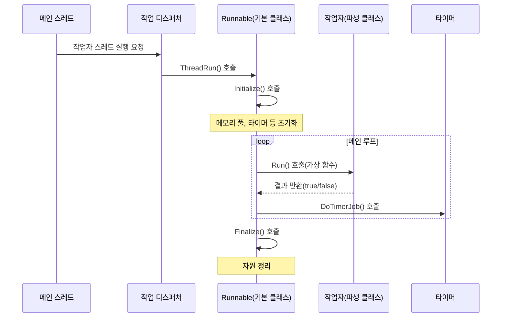

# Chapter 6: 실행 가능 인터페이스

[타이머](05_타이머_.md) 장에서 우리는 지정된 시간에 작업을 실행하는 방법에 대해 배웠습니다. 이번 장에서는 스레드로 실행될 수 있는 클래스를 위한 기본 인터페이스인 '실행 가능 인터페이스(Runnable Interface)'에 대해 알아보겠습니다.

## 실행 가능 인터페이스가 필요한 이유

여러분이 대형 회사에서 새로운 직원들을 채용하고 교육해야 한다고 상상해보세요. 각 직원은 서로 다른 업무를 수행하지만, 모든 직원이 따라야 할 공통 규칙이 있습니다. 출근 시간에 도착하여 기본 설정을 완료하고(초기화), 자신의 업무를 수행하며(실행), 하루가 끝나면 정리 후 퇴근합니다(종료).

소프트웨어에서도 마찬가지입니다. 여러 스레드가 서로 다른 작업을 수행하더라도, 모든 스레드는 공통된 생명주기와 기본 행동 패턴을 가질 수 있습니다. 이런 공통 패턴을 정의하는 것이 실행 가능 인터페이스(Runnable)의 목적입니다.

## 실행 가능 인터페이스의 기본 구조

`Dispatcher` 프로젝트에서 실행 가능 인터페이스는 `Runnable` 클래스로 구현되어 있습니다:

```cpp
class Runnable
{
public:
  Runnable() = default;
  virtual ~Runnable() = default;

  void ThreadRun();

  virtual bool Run() = 0;

private:
  void Initialize();
  void Finalize();
};
```

이 코드의 핵심 요소를 살펴보면:
- `ThreadRun()`: 스레드의 실행 흐름을 관리하는 메인 함수입니다.
- `Run()`: 파생 클래스에서 반드시 구현해야 하는 순수 가상 함수입니다.
- `Initialize()`: 스레드 시작 시 필요한 초기화 작업을 수행합니다.
- `Finalize()`: 스레드 종료 시 자원을 정리합니다.

## 간단한 실행 가능 클래스 만들기

실행 가능 인터페이스를 구현하는 간단한 클래스를 만들어 보겠습니다:

```cpp
class GameWorker : public Runnable
{
public:
  virtual bool Run() override
  {
    // 게임 관련 작업 처리
    ProcessGameLogic();
    
    // false 반환 시 스레드 종료
    return !mShouldStop;
  }
  
  void Stop() { mShouldStop = true; }
  
private:
  bool mShouldStop = false;
};
```

이 예제에서 `GameWorker` 클래스는 Runnable을 상속받아 게임 로직을 처리하는 작업자를 구현했습니다. `Run()` 메서드에서 실제 게임 작업을 처리하고, `mShouldStop` 변수로 스레드 종료를 제어합니다.

## ThreadRun 메서드의 내부 구현

`ThreadRun()` 메서드는 스레드의 전체 생명주기를 관리합니다:

```cpp
void Runnable::ThreadRun()
{
  Initialize();

  while (true)
  {
    if (false == Run())
      break;

    // 타이머 작업 처리
    LTimer->DoTimerJob();
  }

  Finalize();
}
```

이 코드의 실행 흐름은 다음과 같습니다:
1. `Initialize()`로 필요한 자원을 초기화합니다.
2. 무한 루프를 시작합니다.
3. 파생 클래스의 `Run()` 메서드를 호출하고, false 반환 시 루프를 종료합니다.
4. 타이머 작업을 처리합니다.
5. 종료 시 `Finalize()`로 자원을 정리합니다.

## 초기화와 종료

실행 가능 인터페이스는 스레드 시작 시 필요한 초기화와 종료 시 정리 작업을 자동으로 처리합니다:

```cpp
void Runnable::Initialize()
{
  LMemoryPool = new LocalMemoryPool;
  LExecuterList = new ExecuterListType;
  LTimer = new Timer;
}

void Runnable::Finalize()
{
  delete LTimer;
  delete LExecuterList;
  delete LMemoryPool;
}
```

`Initialize()`는 스레드별 메모리 풀, 실행기 목록, 타이머 등을 생성하고, `Finalize()`는 이러한 자원을 해제합니다. 이렇게 함으로써 모든 스레드가 필요한 기본 환경을 가질 수 있습니다.

## 실행 흐름 이해하기

실행 가능 인터페이스가 작동하는 과정을 다이어그램으로 살펴보겠습니다:



이 다이어그램은 스레드가 생성되어 작업을 수행하고 종료되는 전체 과정을 보여줍니다. 기본 클래스(Runnable)가 전체 흐름을 관리하는 동안, 파생 클래스는 구체적인 작업 내용만 구현하면 됩니다.

## 실행 가능 인터페이스와 작업 디스패처

실행 가능 인터페이스는 [작업 디스패처](04_작업_디스패처_.md)와 함께 사용될 때 그 진가를 발휘합니다:

```cpp
template <class T>
class JobDispatcher
{
public:
  JobDispatcher(int workerCount) : mWorkerThreadCount(workerCount)
  {
    // T가 Runnable을 상속했는지 확인
    static_assert(std::is_convertible<T*, Runnable*>::value, 
                 "Runnable만 허용됨");
  }
  
  void RunWorkerThreads()
  {
    for (int i = 0; i < mWorkerThreadCount; ++i)
    {
      mWorkerThreadList.push_back(
        std::thread(&T::ThreadRun, new T()));
    }
  }
};
```

작업 디스패처는 템플릿 매개변수 `T`가 반드시 `Runnable`을 상속해야 한다고 지정합니다. 그리고 지정된 수만큼 작업자 스레드를 생성하고, 각 스레드에서 `ThreadRun()` 메서드를 실행합니다.

## 타이머와의 연동

실행 가능 인터페이스는 [타이머](05_타이머_.md)와 자동으로 연동됩니다:

```cpp
while (true)
{
  if (false == Run())
    break;

  // 타이머 작업 처리
  LTimer->DoTimerJob();
}
```

메인 루프에서 매번 `DoTimerJob()`을 호출하여 시간이 된 타이머 작업들을 자동으로 처리합니다. 이렇게 함으로써 개발자가 별도로 타이머 처리 코드를 작성할 필요 없이, 모든 스레드가 타이머 기능을 활용할 수 있습니다.

## 실제 사용 예제: 게임 서버 구현

게임 서버에서 서로 다른 종류의 작업을 처리하는 여러 스레드를 구현해 보겠습니다:

```cpp
// 네트워크 작업자
class NetworkWorker : public Runnable
{
public:
  virtual bool Run() override
  {
    ProcessNetworkPackets();
    return !mShouldStop;
  }
  
private:
  bool mShouldStop = false;
};

// 게임 로직 작업자
class GameLogicWorker : public Runnable
{
public:
  virtual bool Run() override
  {
    UpdateGameState();
    return !mShouldStop;
  }
  
private:
  bool mShouldStop = false;
};
```

이제 이 작업자들을 사용하는 메인 코드를 작성합니다:

```cpp
int main()
{
  // 네트워크용 스레드 2개, 게임 로직용 스레드 4개 생성
  JobDispatcher<NetworkWorker> netDispatcher(2);
  JobDispatcher<GameLogicWorker> gameDispatcher(4);
  
  netDispatcher.RunWorkerThreads();
  gameDispatcher.RunWorkerThreads();
  
  // 기타 메인 로직...
  return 0;
}
```

이 예제에서는 네트워크 처리용과 게임 로직 처리용으로 서로 다른 작업자 클래스를 만들었습니다. 두 클래스 모두 `Runnable`을 상속받아 필요한 기능만 구현하면, 스레드 생명주기 관리와 타이머 처리 같은 공통 기능은 자동으로 제공됩니다.

## 실행 가능 인터페이스의 장점

실행 가능 인터페이스를 사용함으로써 얻을 수 있는 주요 장점:

1. **코드 재사용**: 스레드 생명주기 관리, 타이머 처리 등 공통 코드를 중앙화하여 중복을 방지합니다.
2. **일관된 패턴**: 모든 작업자 스레드가 동일한 기본 패턴을 따르므로 코드 이해와 유지보수가 쉬워집니다.
3. **자원 관리 자동화**: 초기화와 종료 시 필요한 자원 관리가 자동으로 처리됩니다.
4. **확장성**: 새로운 종류의 작업자가 필요할 때, 간단히 `Run()` 메서드만 구현하면 됩니다.

## 주의사항

실행 가능 인터페이스를 사용할 때 주의할 점:

1. **스레드 안전성**: `Run()` 메서드에서 공유 자원에 접근할 때 적절한 동기화가 필요합니다.
2. **종료 조건**: 적절한 시점에 `Run()`이 `false`를 반환하도록 하여 스레드가 깔끔하게 종료되도록 해야 합니다.
3. **리소스 누수**: 파생 클래스에서 추가로 할당한 자원은 명시적으로 해제해야 합니다.
4. **과도한 실행**: `Run()` 메서드가 너무 오래 실행되면 타이머 작업이 지연될 수 있습니다.

## 요약 및 다음 단계

이번 장에서는 스레드로 실행될 수 있는 클래스의 기본 인터페이스인 실행 가능 인터페이스에 대해 배웠습니다. 실행 가능 인터페이스는 스레드의 초기화, 실행, 종료라는 생명주기를 정의하며, 파생 클래스는 `Run()` 메서드를 구현하여 구체적인 작업 내용을 정의합니다.

실행 가능 인터페이스의 주요 특징:
- 스레드 생명주기 관리 자동화
- 공통 기능(타이머 작업 처리 등) 제공
- 작업 디스패처와의 간편한 통합
- 코드 재사용성 및 유지보수성 향상

다음 장인 [객체 풀](07_객체_풀_.md)에서는 자주 사용되는 객체를 효율적으로 관리하고 재사용하는 객체 풀 패턴에 대해 알아보겠습니다. 객체 풀은 메모리 할당 및 해제에 따른 오버헤드를 줄여 프로그램의 성능을 향상시키는 중요한 기법입니다.

---

Generated by [AI Codebase Knowledge Builder](https://github.com/The-Pocket/Tutorial-Codebase-Knowledge)