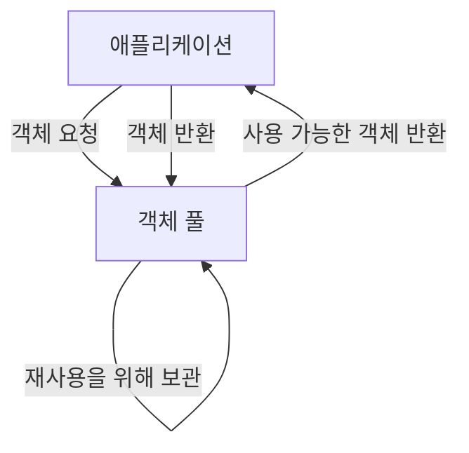
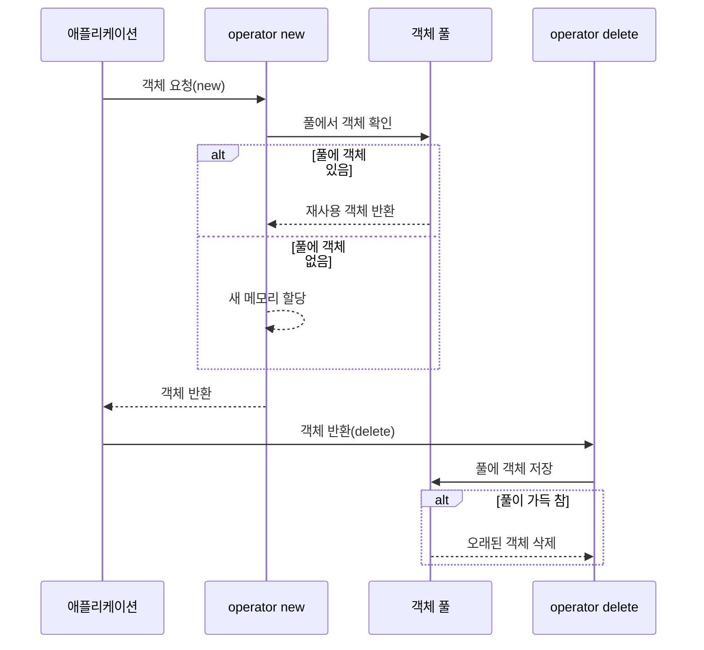

# Chapter 7: 객체 풀
[실행 가능 인터페이스](06_실행_가능_인터페이스_.md) 장에서 스레드의 생명주기를 관리하는 방법에 대해 배웠습니다. 이번 장에서는 성능 최적화의 핵심 기법 중 하나인 '객체 풀(Object Pool)'에 대해 알아보겠습니다.
  

## 객체 풀이 필요한 이유
여러분이 온라인 게임을 개발한다고 상상해보세요. 플레이어가 총을 발사할 때마다 '총알' 객체를 생성하고, 총알이 목표물에 맞거나 화면 밖으로 나가면 객체를 삭제합니다. 초당 수백 발의 총알이 발사된다면 어떻게 될까요?

```cpp
// 일반적인 방식 (비효율적)
void FireBullet() {
    Bullet* bullet = new Bullet();  // 매번 메모리 할당
    // 총알 초기화 및 발사
    
    // 나중에 삭제
    delete bullet;  // 메모리 해제
}
```

이 코드에서는 총알을 발사할 때마다 메모리를 할당하고 해제합니다. 이런 작업은 생각보다 많은 시간을 소모합니다. 객체 풀은 이런 문제를 해결합니다.
  

## 객체 풀의 기본 개념
객체 풀은 마치 수영장에서 사용한 튜브를 버리지 않고 다른 사람이 재사용할 수 있게 보관하는 것과 같습니다. 



객체 풀의 주요 특징:
1. **재사용**: 객체를 삭제하는 대신 풀에 반환하여 재사용
2. **성능 향상**: 메모리 할당/해제 감소로 성능 개선
3. **메모리 관리**: 제한된 개수의 객체만 사용하여 메모리 사용량 예측 가능
  

## ObjectPool 템플릿 클래스 이해하기
`Dispatcher` 프로젝트의 객체 풀은 템플릿 클래스로 구현되어 있어, 어떤 타입의 객체든 풀링할 수 있습니다:

```cpp
template <class T>
class ObjectPool
{
public:
    enum { POOL_MAX_SIZE = 4096 };
    
    static void* operator new(size_t objSize);
    static void operator delete(void* obj);
    
private:
    static std::atomic<void*> mPool[POOL_MAX_SIZE];
    // 기타 멤버 변수들...
};
```

이 코드는 `ObjectPool` 클래스의 기본 구조를 보여줍니다. `operator new`와 `operator delete`를 오버라이딩하여 객체 생성과 삭제를 풀에서 관리합니다.
  

## 객체 풀 사용하기
객체 풀을 사용하는 가장 간단한 방법은 클래스가 `ObjectPool`을 상속받는 것입니다:

```cpp
class Bullet : public ObjectPool<Bullet>
{
public:
    Bullet() : mX(0), mY(0), mSpeed(0) {}
    
    void Initialize(float x, float y, float speed) {
        mX = x;
        mY = y;
        mSpeed = speed;
    }
    
private:
    float mX, mY, mSpeed;
};
```

이제 `Bullet` 객체를 생성하고 삭제할 때 자동으로 객체 풀을 사용합니다:

```cpp
// 객체 풀을 사용한 방식 (효율적)
void FireBullet() {
    Bullet* bullet = new Bullet();  // 풀에서 가져오거나 새로 생성
    bullet->Initialize(playerX, playerY, 10.0f);
    
    // 나중에 사용 완료
    delete bullet;  // 실제로는 풀에 반환됨
}
```

이 코드는 일반적인 `new`와 `delete`를 사용하는 것처럼 보이지만, 내부적으로는 객체 풀을 통해 객체를 재사용합니다.
  

## 객체 풀의 내부 구현
객체 풀이 어떻게 작동하는지 단계별로 살펴보겠습니다:


  

### 객체 할당 (operator new)
`operator new`가 어떻게 구현되었는지 살펴보겠습니다:

```cpp
static void* operator new(size_t objSize)
{
    uint64_t popPos = mHeadPos.fetch_add(1);
    
    void* popVal = std::atomic_exchange(&mPool[popPos & POOL_SIZE_MASK], nullptr);
    if (popVal != nullptr)
        return popVal;
        
    return MEM_ALLOC(objSize);
}
```

이 코드의 작동 방식:
1. 풀에서 위치를 원자적으로 가져옵니다.
2. 해당 위치에 있는 객체를 원자적으로 꺼냅니다.
3. 객체가 있으면 그것을 반환하고, 없으면 새로 할당합니다.
  

### 객체 반환 (operator delete)
`operator delete`가 어떻게 구현되었는지 살펴보겠습니다:

```cpp
static void operator delete(void* obj)
{
    uint64_t insPos = mTailPos.fetch_add(1);
    
    void* prevVal = std::atomic_exchange(&mPool[insPos & POOL_SIZE_MASK], obj);
    
    if (prevVal != nullptr)
        MEM_FREE(prevVal);
}
```

이 코드의 작동 방식:
1. 풀에서 저장할 위치를 원자적으로 가져옵니다.
2. 반환된 객체를 해당 위치에 원자적으로 저장합니다.
3. 이미 그 위치에 다른 객체가 있었다면 그 객체는 실제로 메모리를 해제합니다.
  

## 객체 풀의 성능 이점
객체 풀을 사용하면 다음과 같은 성능 이점이 있습니다:

1. **할당/해제 오버헤드 감소**: 시스템 메모리 할당자 호출 횟수 감소
2. **메모리 단편화 감소**: 일정한 크기의 객체를 재사용하므로 단편화 최소화
3. **캐시 효율성 향상**: 동일한 메모리 위치를 재사용하므로 캐시 히트율 증가
4. **예측 가능한 성능**: 동적 할당의 불규칙적인 성능 변동 감소
  

## 객체 풀 사용 예제: 게임 총알 시스템
게임에서 총알 시스템을 구현하는 실제 예제를 살펴보겠습니다:

```cpp
class Bullet : public ObjectPool<Bullet>
{
public:
    void Update() {
        mX += mDirX * mSpeed;
        mY += mDirY * mSpeed;
        // 총알 업데이트 로직
    }
    
private:
    float mX, mY, mDirX, mDirY, mSpeed;
};
```

이 클래스는 `ObjectPool<Bullet>`을 상속받아 총알 객체를 풀링합니다.

게임 루프에서의 사용:

```cpp
class Game {
private:
    std::vector<Bullet*> mActiveBullets;
    
public:
    void FireBullet(float x, float y, float dirX, float dirY) {
        Bullet* bullet = new Bullet();  // 풀에서 가져옴
        bullet->Initialize(x, y, dirX, dirY, 5.0f);
        mActiveBullets.push_back(bullet);
    }
    
    void Update() {
        // 활성 총알 업데이트 및 관리
        for (auto it = mActiveBullets.begin(); it != mActiveBullets.end();) {
            Bullet* bullet = *it;
            bullet->Update();
            
            if (bullet->IsOutOfScreen() || bullet->HasHit()) {
                delete bullet;  // 풀에 반환
                it = mActiveBullets.erase(it);
            } else {
                ++it;
            }
        }
    }
};
```

이 코드는 게임에서 총알을 발사하고 관리하는 방법을 보여줍니다. `new`와 `delete`는 일반적인 메모리 할당/해제처럼 보이지만, 내부적으로는 객체 풀을 사용합니다.
  

## 객체 풀 사용 시 주의사항
객체 풀을 사용할 때 몇 가지 주의해야 할 점:

1. **객체 상태 초기화**: 풀에서 가져온 객체는 이전에 사용된 적이 있을 수 있으므로, 항상 상태를 초기화해야 합니다.
2. **메모리 사용량**: 풀 크기에 따라 항상 일정량의 메모리를 사용합니다.
3. **스레드 안전성**: 멀티스레드 환경에서는 원자적 연산을 사용해야 합니다.
4. **풀 크기 제한**: 너무 작으면 성능 이점이 줄어들고, 너무 크면 메모리를 낭비합니다.
  

## 다른 모듈과의 연계
객체 풀은 [작업 (Job)](02_작업__job__.md)과 같은 다른 모듈과 자주 함께 사용됩니다:

```cpp
template <class ObjType, class... ArgTypes>
struct Job : public JobEntry, ObjectPool<Job<ObjType, ArgTypes...>>
{
    // Job 구현...
};
```

이 코드는 `Job` 클래스가 `ObjectPool`을 상속받아 작업 객체를 풀링하는 방법을 보여줍니다. 이를 통해 작업이 자주 생성되고 삭제되는 상황에서도 성능을 유지할 수 있습니다.
  

## 요약 및 다음 단계
이번 장에서는 객체 풀의 개념과 구현 방법에 대해 배웠습니다. 객체 풀은 자주 생성되고 삭제되는 객체를 재사용하여 메모리 할당/해제 비용을 줄이는 기법입니다. 템플릿 기반 설계를 통해 다양한 타입의 객체에 쉽게 적용할 수 있으며, `operator new`와 `operator delete`를 오버라이딩하여 객체 생성과 삭제 과정을 가로채는 방식으로 구현됩니다.

객체 풀의 주요 이점:
- 메모리 할당/해제 오버헤드 감소
- 메모리 단편화 감소
- 성능 향상 및 예측 가능성 증가
- 캐시 효율성 향상

다음 장인 [스레드 로컬 저장소](08_스레드_로컬_저장소_.md)에서는 각 스레드가 독립적인 데이터를 관리하는 방법에 대해 알아보겠습니다. 스레드 로컬 저장소는 멀티스레드 환경에서 락을 사용하지 않고도 스레드별 데이터를 안전하게 접근할 수 있게 해주는 중요한 기법입니다.

---

Generated by [AI Codebase Knowledge Builder](https://github.com/The-Pocket/Tutorial-Codebase-Knowledge)