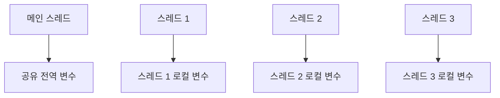
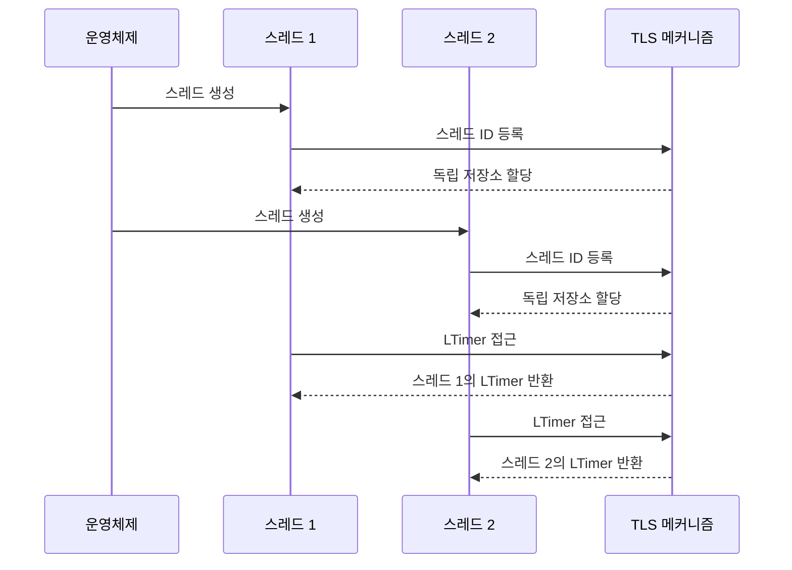
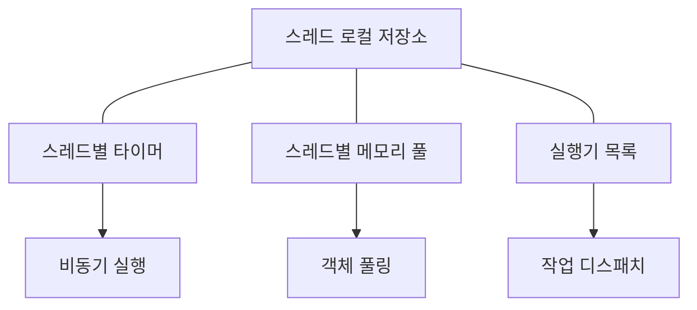

# Chapter 8: 스레드 로컬 저장소
[객체 풀](07_객체_풀_.md) 장에서 메모리 할당 최적화 방법을 배웠습니다. 이번 장에서는 멀티스레드 환경에서 안전하게 데이터를 관리하는 '스레드 로컬 저장소(Thread Local Storage)'에 대해 알아보겠습니다.

## 스레드 로컬 저장소가 필요한 이유
현대 소프트웨어는 여러 스레드를 동시에 실행하여 성능을 향상시킵니다. 하지만 여러 스레드가 동일한 데이터에 접근할 때 문제가 발생할 수 있습니다.

예를 들어, 사무실에서 여러 동료가 같은 문서에 동시에 작업한다고 생각해 보세요. 수정 내용이 충돌하거나 한 사람의 변경이 다른 사람의 작업을 방해할 수 있습니다. 이 문제를 해결하려면 각자 문서의 사본을 가지고 작업하면 됩니다.

스레드 로컬 저장소도 이와 같은 원리입니다. 각 스레드가 자신만의 변수 사본을 가지므로, 데이터 접근 충돌 없이 안전하게 작업할 수 있습니다.


  

## 스레드 로컬 저장소의 기본 개념
스레드 로컬 저장소는 다음과 같은 특징을 가집니다:

1. **변수 독립성**: 각 스레드는 동일한 변수의 독립적인 사본을 가집니다.
2. **락 불필요**: 스레드별로 독립된 데이터이므로 락(lock)이 필요 없습니다.
3. **생명주기**: 스레드가 생성될 때 할당되고, 종료될 때 해제됩니다.

이는 마치 각 직원이 자신만의 업무 노트를 가지는 것과 같습니다. 다른 직원의 노트를 신경 쓸 필요 없이 자신의 노트에 자유롭게 작성할 수 있습니다.
  

## C++에서 스레드 로컬 변수 선언하기
C++에서는 `thread_local` 키워드를 사용하여 스레드 로컬 변수를 선언합니다:

```cpp
// 스레드 로컬 변수 선언
thread_local int myCounter = 0;

void IncrementCounter() {
    myCounter++; // 각 스레드마다 별도의 카운터 증가
    std::cout << "카운터: " << myCounter << std::endl;
}
```

이 코드에서 `myCounter`는 스레드 로컬 변수입니다. 여러 스레드가 동시에 `IncrementCounter()`를 호출해도 각자의 카운터를 독립적으로 증가시킵니다.
  

## Dispatcher 프로젝트의 스레드 로컬 변수

`Dispatcher` 프로젝트에서는 여러 중요한 스레드 로컬 변수를 사용합니다:

```cpp
// ThreadLocal.h에서 선언된 스레드 로컬 변수들
extern thread_local Timer* LTimer;
extern thread_local int64_t LTickCount;
extern thread_local ExecuterListType* LExecuterList;
extern thread_local AsyncExecutable* LCurrentExecuterOccupyingThisThread;
extern thread_local LocalMemoryPool* LMemoryPool;
```

이 변수들은 각 스레드가 독립적으로 사용하는 중요한 도구들입니다:

- `LTimer`: 스레드별 [타이머](05_타이머_.md) 객체
- `LTickCount`: 현재 틱 카운트 값
- `LExecuterList`: 실행기 목록
- `LCurrentExecuterOccupyingThisThread`: 현재 스레드를 점유 중인 실행기
- `LMemoryPool`: 스레드별 메모리 풀
  

## 스레드 로컬 변수 초기화하기
스레드 로컬 변수는 각 스레드가 시작될 때 초기화해야 합니다. [실행 가능 인터페이스](06_실행_가능_인터페이스_.md)의 `Initialize()` 메서드에서 이 작업을 수행합니다:

```cpp
void Runnable::Initialize()
{
  // 스레드 로컬 변수 초기화
  LMemoryPool = new LocalMemoryPool;
  LExecuterList = new ExecuterListType;
  LTimer = new Timer;
}
```

이 코드는 스레드가 시작될 때 필요한 스레드 로컬 객체들을 생성하고 초기화합니다. 각 스레드는 자신만의 메모리 풀, 실행기 목록, 타이머를 가지게 됩니다.
  

## 스레드 로컬 타이머 사용 예제
스레드 로컬 변수의 활용 예로 타이머를 살펴보겠습니다:

```cpp
void DoTimerJob() {
    // 현재 스레드의 타이머를 사용
    LTimer->DoTimerJob();
}

void ScheduleTask() {
    // 500ms 후 작업 예약
    LTimer->PushTimerJob(myExecutable, 500, myJob);
}
```

이 코드에서 `LTimer`는 스레드 로컬 변수이므로, 각 스레드가 자신만의 타이머를 가집니다. 한 스레드에서 타이머 작업을 예약해도 다른 스레드의 타이머에는 영향을 주지 않습니다.
  

## 스레드 로컬 저장소의 내부 작동 방식

스레드 로컬 저장소가 어떻게 작동하는지 단계별로 살펴보겠습니다:



이 다이어그램은 다음 과정을 보여줍니다:
1. 운영체제가 스레드를 생성합니다.
2. 각 스레드는 TLS(Thread Local Storage) 메커니즘에 등록됩니다.
3. 각 스레드에 독립적인 저장 공간이 할당됩니다.
4. 스레드가 스레드 로컬 변수에 접근하면, TLS 메커니즘이 해당 스레드의 변수 사본을 반환합니다.
  

## 플랫폼별 스레드 로컬 저장소 구현
`Dispatcher` 프로젝트는 여러 플랫폼을 지원하기 위해 다음과 같이 `thread_local` 키워드를 정의합니다:

```cpp
#ifdef WIN32
#define thread_local __declspec(thread)
#else
#define thread_local __thread
#endif
```

이 코드는 Windows와 다른 플랫폼에서 각각 다른 스레드 로컬 선언 방식을 사용할 수 있게 해줍니다:
- Windows에서는 `__declspec(thread)` 사용
- 다른 플랫폼(Linux, macOS 등)에서는 `__thread` 사용
  

## 실제 사용 예제: 멀티스레드 게임 서버
멀티스레드 게임 서버에서 스레드 로컬 저장소를 활용하는 예제를 살펴보겠습니다:

```cpp
class GameWorker : public Runnable
{
public:
    virtual bool Run() override
    {
        // 스레드 로컬 카운터 증가
        mLocalCounter++;
        
        // 스레드 로컬 타이머 사용
        LTimer->DoTimerJob();
        
        // 기타 게임 로직...
        return true;
    }
    
private:
    thread_local static int mLocalCounter;
};
```

이 코드에서 `mLocalCounter`는 각 `GameWorker` 스레드가 독립적으로 관리하는 카운터입니다. 또한 `LTimer`를 사용하여 타이머 작업을 처리합니다.
  

## 스레드 로컬 메모리 풀 활용하기
`Dispatcher` 프로젝트에서는 스레드별 메모리 풀(`LMemoryPool`)을 사용하여 메모리 할당 성능을 향상시킵니다:

```cpp
void* AllocateMemory(size_t size) {
    // 현재 스레드의 메모리 풀 사용
    return LMemoryPool->Allocate(size);
}

void FreeMemory(void* ptr) {
    // 현재 스레드의 메모리 풀에 반환
    LMemoryPool->Free(ptr);
}
```

각 스레드가 자신만의 메모리 풀을 가지므로, 다른 스레드와의 경쟁 없이 빠르게 메모리를 할당하고 해제할 수 있습니다. 이는 [메모리 풀 할당기](09_메모리_풀_할당기_.md) 장에서 더 자세히 다룹니다.
  

## 스레드 로컬 저장소와 다른 모듈의 연결
스레드 로컬 저장소는 [타이머](05_타이머_.md), [비동기 실행기](01_비동기_실행기_.md), [객체 풀](07_객체_풀_.md) 등 다양한 모듈과 함께 작동합니다:



각 스레드는 독립적인 도구 세트를 가지고 있으며, 이를 통해 다른 스레드와의 충돌 없이 효율적으로 작업을 수행할 수 있습니다.
  

## 스레드 로컬 저장소 사용 시 주의사항
스레드 로컬 저장소를 사용할 때 몇 가지 주의해야 할 점:

1. **메모리 사용량**: 스레드마다 별도의 메모리가 필요하므로, 스레드 수가 많아지면 메모리 사용량이 증가합니다.
2. **초기화와 정리**: 스레드 시작 시 초기화하고 종료 시 정리해야 합니다.
3. **스레드 간 데이터 공유**: 스레드 로컬 데이터는 기본적으로 공유되지 않으므로, 필요한 경우 명시적으로 공유 메커니즘을 구현해야 합니다.
4. **성능 고려**: 스레드 로컬 접근은 일반 변수보다 약간 느릴 수 있습니다.
  

## 실생활 비유로 이해하기
스레드 로컬 저장소는 회사의 개인 사물함과 같습니다:

1. **개인 소유**: 각 직원(스레드)은 자신만의 사물함(저장소)을 가집니다.
2. **충돌 없음**: 다른 직원의 사물함을 걱정할 필요 없이 자유롭게 사용할 수 있습니다.
3. **개인화**: 각자의 필요에 맞게 사물함 내용을 구성할 수 있습니다.
4. **생명주기**: 직원이 입사(스레드 생성)할 때 사물함이 할당되고, 퇴사(스레드 종료)할 때 비워집니다.
  

## 요약 및 다음 단계
이번 장에서는 스레드 로컬 저장소의 개념과 사용법에 대해 배웠습니다. 스레드 로컬 저장소는 각 스레드가 자신만의 변수 사본을 가질 수 있게 해주어, 데이터 경쟁 없이 안전하게 상태를 관리할 수 있게 합니다. `thread_local` 키워드를 사용하여 C++에서 쉽게 스레드 로컬 변수를 선언할 수 있으며, 이를 통해 타이머, 메모리 풀 등의 독립적인 인스턴스를 각 스레드에 제공할 수 있습니다.

스레드 로컬 저장소의 주요 특징:
- 스레드별 독립적인 데이터 관리
- 락 없이도 스레드 안전성 보장
- 성능 향상 및 경쟁 조건 제거
- 코드 단순화 및 유지보수성 향상

다음 장인 [메모리 풀 할당기](09_메모리_풀_할당기_.md)에서는 스레드 로컬 저장소를 활용한 효율적인 메모리 관리 방법에 대해 자세히 알아보겠습니다. 메모리 풀 할당기는 동적 메모리 할당의 성능 부담을 줄이고 메모리 단편화를 방지하는 중요한 최적화 기법입니다.

---

Generated by [AI Codebase Knowledge Builder](https://github.com/The-Pocket/Tutorial-Codebase-Knowledge)