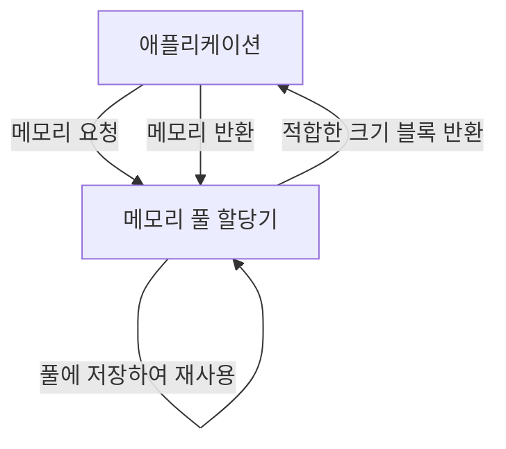
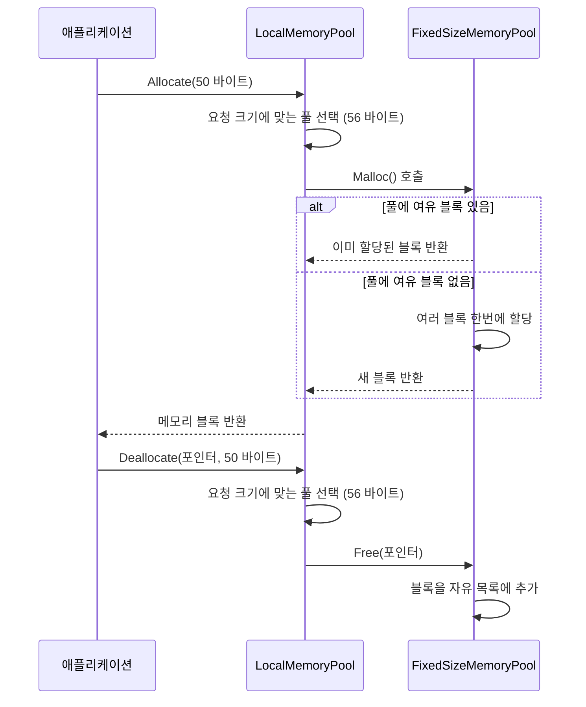

# Chapter 9: 메모리 풀 할당기
[스레드 로컬 저장소](08_스레드_로컬_저장소_.md) 장에서 우리는 각 스레드가 독립적으로 데이터를 관리하는 방법을 배웠습니다. 이번 장에서는 메모리 관리 최적화의 핵심 기법인 '메모리 풀 할당기'에 대해 알아보겠습니다.

## 메모리 풀 할당기가 필요한 이유
게임 개발 중에 매 프레임마다 총알, 이펙트, 적 캐릭터 등을 생성하고 삭제하는 상황을 생각해 보세요. 일반적인 방식으로 메모리를 할당하고 해제하면 어떤 문제가 발생할까요?

```cpp
// 일반적인 메모리 할당 방식
void CreateBullets() {
    for (int i = 0; i < 100; ++i) {
        Bullet* bullet = new Bullet(); // 매번 운영체제에 메모리 요청
        // 총알 초기화
    }
}
```

이런 방식은 두 가지 주요 문제를 일으킵니다:
1. **성능 저하**: 매번 운영체제에 메모리를 요청하는 것은 느립니다.
2. **메모리 단편화**: 반복적인 할당과 해제로 메모리가 조각조각 나뉩니다.

메모리 풀 할당기는 이런 문제를 해결합니다. 마치 다양한 크기의 상자를 미리 준비해두고, 필요할 때 적합한 크기의 상자를 빠르게 제공하는 것과 같습니다.
  

## 메모리 풀 할당기의 기본 개념
메모리 풀 할당기의 핵심 개념은 다음과 같습니다:

1. **고정 크기 블록**: 다양한 크기의 메모리 블록을 미리 할당해 둡니다.
2. **빠른 할당**: 새 메모리가 필요할 때 운영체제가 아닌 풀에서 빠르게 가져옵니다.
3. **효율적인 재사용**: 더 이상 필요 없는 메모리는 풀에 반환하여 재사용합니다.



실생활로 비유하자면, 분류된 서랍장을 생각해 보세요. 작은 물건은 작은 서랍에, 큰 물건은 큰 서랍에 보관합니다. 물건이 필요할 때 서랍에서 꺼내고, 다 사용한 후에는 다시 서랍에 넣어둡니다.
  

## 메모리 풀 할당기 구조 이해하기
`Dispatcher` 프로젝트의 메모리 풀 할당기는 두 가지 주요 클래스로 구성됩니다:

1. **FixedSizeMemoryPool**: 단일 크기의 메모리 블록을 관리합니다.
2. **LocalMemoryPool**: 여러 크기의 메모리 풀을 관리합니다.
  

### FixedSizeMemoryPool 클래스
먼저 고정 크기 메모리 풀의 기본 구조를 살펴보겠습니다:

```cpp
class FixedSizeMemoryPool {
public:
    FixedSizeMemoryPool() : mAllocSize(0), mFreeList(nullptr) {}
    
    void* Malloc();
    void Free(void* ptr);
    void SetFixedAllocSize(size_t size);
    
private:
    size_t mAllocSize;   // 블록 크기
    uint8_t* mFreeList;  // 사용 가능한 블록 목록
};
```

이 클래스는 동일한 크기의 메모리 블록을 관리합니다. `mFreeList`는 사용 가능한 블록들을 연결 리스트 형태로 저장합니다.
  

### LocalMemoryPool 클래스
다음으로 다양한 크기의 메모리 풀을 관리하는 클래스를 살펴보겠습니다:

```cpp
class LocalMemoryPool {
public:
    LocalMemoryPool();
    
    void* Allocate(size_t size);
    void Deallocate(void* ptr, size_t size);
    
private:
    FixedSizeMemoryPool mFixedSizeMemoryPool[MAX_POOL_SIZE];
    size_t mAllocCountTable[MAX_POOL_SIZE];
};
```

이 클래스는 여러 개의 `FixedSizeMemoryPool`을 관리합니다. 각 풀은 다른 크기의 메모리 블록을 담당합니다. 요청된 크기에 맞는 풀을 선택하여 메모리를 할당합니다.
  

## 메모리 풀 할당기 사용하기
메모리 풀 할당기를 사용하는 방법은 매우 간단합니다:

```cpp
// 메모리 할당
void* buffer = LMemoryPool->Allocate(128);

// 사용 후 해제
LMemoryPool->Deallocate(buffer, 128);
```

이 코드는 현재 스레드의 로컬 메모리 풀(`LMemoryPool`)에서 128바이트 크기의 메모리를 할당받고, 나중에 해제합니다. 주목할 점은 할당 시 지정한 크기를 해제 시에도 알려줘야 한다는 것입니다.
  

## STL 컨테이너와 함께 사용하기
메모리 풀 할당기는 STL 컨테이너와 함께 사용할 수 있습니다:

```cpp
// STL 컨테이너가 메모리 풀을 사용하도록 설정
std::vector<int, STLAllocator<int>> myVector;
std::map<int, float, std::less<int>, STLAllocator<std::pair<const int, float>>> myMap;
```

이 코드는 `STLAllocator`를 사용하여 STL 컨테이너가 일반 메모리 할당 대신 메모리 풀을 사용하도록 합니다. 이렇게 하면 STL 컨테이너의 성능이 향상됩니다.
  

## 메모리 풀 할당기의 내부 구현
메모리 풀 할당기가 어떻게 작동하는지 단계별로 살펴보겠습니다:



이 다이어그램은 메모리 할당과 해제 과정을 보여줍니다. 특히 주목할 점은 메모리 풀이 필요한 블록이 없을 때 한 번에 여러 블록을 할당한다는 것입니다.
  

### 메모리 블록 할당하기
`FixedSizeMemoryPool`의 `Malloc` 메서드가 어떻게 구현되었는지 살펴보겠습니다:

```cpp
void* FixedSizeMemoryPool::Malloc() {
    if (!mFreeList) {
        // 여유 블록이 없으면 한 번에 여러 개 할당
        mFreeList = static_cast<uint8_t*>(malloc(mAllocSize * ALLOC_COUNT));
        
        // 할당된 블록들을 연결 리스트로 연결
        uint8_t* pNext = mFreeList;
        uint8_t** ppCurr = reinterpret_cast<uint8_t**>(mFreeList);
        
        for (int i = 0; i < ALLOC_COUNT - 1; ++i) {
            pNext += mAllocSize;
            *ppCurr = pNext;
            ppCurr = reinterpret_cast<uint8_t**>(pNext);
        }
        
        *ppCurr = 0; // 마지막 블록은 nullptr 가리킴
    }
    
    // 첫 번째 여유 블록 반환
    uint8_t* pAvailable = mFreeList;
    mFreeList = *reinterpret_cast<uint8_t**>(pAvailable);
    
    return pAvailable;
}
```

이 코드는 다음과 같은 작업을 수행합니다:
1. 자유 목록(`mFreeList`)이 비어있으면, 한 번에 여러 개(ALLOC_COUNT)의 블록을 할당합니다.
2. 할당된 블록들을 연결 리스트로 구성합니다.
3. 자유 목록에서 첫 번째 블록을 가져와 반환합니다.

메모리 블록은 연결 리스트 형태로 관리됩니다. 각 블록의 첫 부분에는 다음 블록을 가리키는 포인터가 저장됩니다.
  

### 메모리 블록 해제하기
`FixedSizeMemoryPool`의 `Free` 메서드는 다음과 같습니다:

```cpp
void FixedSizeMemoryPool::Free(void* ptr) {
    // 반환된 블록의 시작 부분에 현재 자유 목록 주소 저장
    *reinterpret_cast<uint8_t**>(ptr) = mFreeList;
    // 자유 목록이 반환된 블록을 가리키도록 업데이트
    mFreeList = static_cast<uint8_t*>(ptr);
}
```

이 코드는 매우 간단합니다. 반환된 블록을 자유 목록의 맨 앞에 추가합니다. 블록의 첫 부분에 현재 자유 목록의 주소를 저장하고, 자유 목록 포인터를 이 블록으로 업데이트합니다.
  

### 크기별 풀 관리
`LocalMemoryPool`은 요청 크기에 맞는 풀을 선택합니다:

```cpp
void* LocalMemoryPool::Allocate(size_t size) {
    if (size >= MAX_CHUNK_SIZE) {
        // 너무 큰 요청은 일반 malloc 사용
        return malloc(size);
    } else {
        // 적절한 풀 선택
        size_t idx = GetPoolIndex(size);
        ++mAllocCountTable[idx];
        return mFixedSizeMemoryPool[idx].Malloc();
    }
}
```

이 코드는:
1. 요청 크기가 최대 청크 크기보다 크면 일반 `malloc`을 사용합니다.
2. 그렇지 않으면 크기에 맞는 풀을 선택하여 메모리를 할당합니다.
3. 할당 카운트를 증가시켜 풀 사용 현황을 추적합니다.

풀 인덱스는 요청 크기를 할당 단위(ALLOC_GRANULARITY)로 나누어 계산합니다. 예를 들어, 할당 단위가 8바이트이면 24바이트 요청은 인덱스 3(24/8=3)의 풀을 사용합니다.
  
  
## 메모리 풀 할당기와 스레드 로컬 저장소의 연계
메모리 풀 할당기는 [스레드 로컬 저장소](08_스레드_로컬_저장소_.md)와 함께 사용됩니다:

```cpp
// ThreadLocal.h에 선언된 스레드 로컬 메모리 풀
extern thread_local LocalMemoryPool* LMemoryPool;

// 스레드 시작 시 초기화
void Runnable::Initialize() {
    LMemoryPool = new LocalMemoryPool;
    // 기타 초기화...
}
```

각 스레드는 자신만의 메모리 풀을 가지므로, 다른 스레드와의 경쟁 없이 빠르게 메모리를 할당하고 해제할 수 있습니다. 이는 멀티스레드 환경에서 특히 중요한 성능 최적화입니다.
  

## 메모리 풀 할당기와 객체 풀의 차이점
메모리 풀 할당기는 [객체 풀](07_객체_풀_.md)과 비슷하지만 다른 목적을 가집니다:

1. **메모리 풀 할당기**: 다양한 크기의 일반 메모리 블록을 관리합니다.
2. **객체 풀**: 특정 타입의 객체만 관리합니다.

예를 들어:
- 메모리 풀 할당기는 "50바이트 메모리가 필요해요"라는 요청을 처리합니다.
- 객체 풀은 "Player 객체가 필요해요"라는 요청을 처리합니다.

두 기법은 종종 함께 사용됩니다. 객체 풀이 내부적으로 메모리 풀 할당기를 사용할 수 있습니다.
  

## 메모리 풀 할당기의 장점
메모리 풀 할당기의 주요 장점은 다음과 같습니다:

1. **성능 향상**: 시스템 메모리 할당자(`malloc`/`free`)보다 빠릅니다.
2. **단편화 감소**: 고정 크기 블록 사용으로 메모리 단편화를 줄입니다.
3. **예측 가능성**: 할당 시간이 일정하여 성능 예측이 쉬워집니다.
4. **메모리 누수 디버깅**: 할당 카운트 추적으로 메모리 누수 감지가 쉬워집니다.
  

## 실제 사용 예제: 게임 파티클 시스템
게임 파티클 시스템에서 메모리 풀 할당기를 활용하는 예제를 살펴보겠습니다:

```cpp
class ParticleSystem {
private:
    std::vector<Particle*, STLAllocator<Particle*>> mParticles;
    
public:
    void CreateExplosion(float x, float y) {
        for (int i = 0; i < 100; ++i) {
            // 메모리 풀에서 파티클 메모리 할당
            Particle* p = new (LMemoryPool->Allocate(sizeof(Particle))) Particle();
            p->Initialize(x, y);
            mParticles.push_back(p);
        }
    }
    
    void Update() {
        for (auto it = mParticles.begin(); it != mParticles.end();) {
            if ((*it)->IsDead()) {
                // 파티클 소멸 및 메모리 반환
                (*it)->~Particle();
                LMemoryPool->Deallocate(*it, sizeof(Particle));
                it = mParticles.erase(it);
            } else {
                ++it;
            }
        }
    }
};
```

이 코드는 폭발 효과를 위해 100개의 파티클을 생성합니다. 파티클 메모리는 메모리 풀에서 할당되고, 파티클이 수명을 다하면 풀에 반환됩니다. 또한 파티클 포인터를 저장하는 벡터도 `STLAllocator`를 사용하여 메모리 풀을 활용합니다.
  

## 메모리 풀 할당기 사용 시 주의사항
메모리 풀 할당기를 사용할 때 몇 가지 주의해야 할 점:

1. **크기 일치**: 할당 시 지정한 크기와 해제 시 지정한 크기가 정확히 일치해야 합니다.
2. **메모리 초기화**: 풀에서 가져온 메모리는 이전에 사용된 적이 있을 수 있으므로, 필요하다면 초기화해야 합니다.
3. **풀 크기 제한**: 매우 큰 메모리 요청은 풀을 사용하지 않고 일반 `malloc`으로 처리됩니다.
4. **스레드 안전성**: 각 스레드는 자신의 메모리 풀을 사용해야 합니다.
  

## 요약
이번 장에서는 메모리 풀 할당기의 개념과 구현 방법에 대해 배웠습니다. 메모리 풀 할당기는 다양한 크기의 메모리 블록을 미리 할당하고 효율적으로 관리하여 동적 메모리 할당 성능을 크게 향상시킵니다. 특히 작은 크기의 메모리를 자주 할당하고 해제하는 게임이나 실시간 시스템에서 매우 유용합니다.

메모리 풀 할당기의 주요 특징:
- 고정 크기 메모리 블록의 효율적인 관리
- 빠른 메모리 할당 및 해제
- 메모리 단편화 감소
- 스레드별 독립적인 풀로 경쟁 감소

`Dispatcher` 프로젝트는 메모리 풀 할당기, [스레드 로컬 저장소](08_스레드_로컬_저장소_.md), [객체 풀](07_객체_풀_.md) 등의 최적화 기법을 함께 사용하여 높은 성능과 효율성을 달성합니다. 이러한 기법들을 적재적소에 활용하면 프로그램의 성능을 크게 향상시킬 수 있습니다.

---

Generated by [AI Codebase Knowledge Builder](https://github.com/The-Pocket/Tutorial-Codebase-Knowledge)