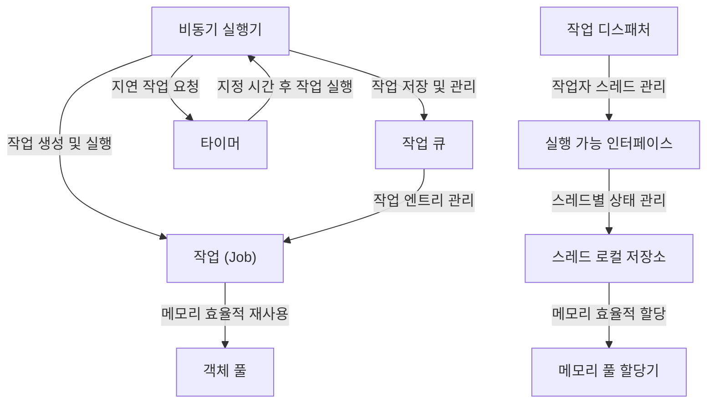

# Tutorial: Dispatcher

**Dispatcher** 프로젝트는 **비동기 작업 처리 시스템**입니다. 이 시스템은 여러 스레드에서 *효율적으로 작업을 분배하고 실행*할 수 있게 해줍니다. 

작업은 큐에 저장되고 적절한 시점에 비동기적으로 실행됩니다. **타이머** 기능을 통해 지정된 시간 후에 작업을 실행할 수도 있습니다. 

또한 **메모리 관리**를 위한 *객체 풀*과 *메모리 풀 할당기*를 활용하여 시스템의 성능을 최적화하고, **스레드 로컬 저장소**를 통해 스레드 간 데이터 경쟁 없이 안전하게 상태를 관리합니다.

**Source Repository:** [GitHub](https://github.com/jacking75/JobDispatcherNET)
  

## Chapters
1. [비동기 실행기](01_비동기_실행기_.md)
2. [작업 (Job)](02_작업__job__.md)
3. [작업 큐](03_작업_큐_.md)
4. [작업 디스패처](04_작업_디스패처_.md)
5. [타이머](05_타이머_.md)
6. [실행 가능 인터페이스](06_실행_가능_인터페이스_.md)
7. [객체 풀](07_객체_풀_.md)
8. [스레드 로컬 저장소](08_스레드_로컬_저장소_.md)
9. [메모리 풀 할당기](09_메모리_풀_할당기_.md)

---

Generated by [AI Codebase Knowledge Builder](https://github.com/The-Pocket/Tutorial-Codebase-Knowledge)